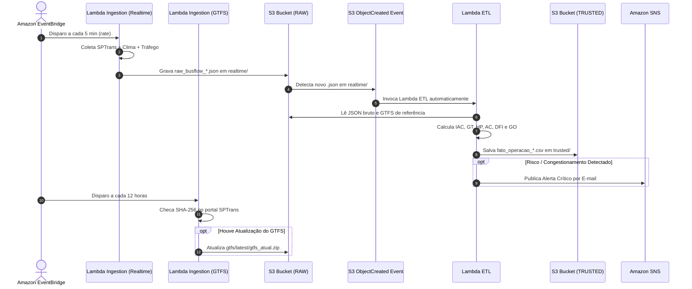

# Documentação de Segurança, Variáveis Centralizadas e Gatilhos (EventBridge & S3)
**Projeto:** BusFlow  
**Versão:** 3.0  

---

## 1. Modelo de Segurança e Proteção de Credenciais

Para atender às melhores práticas da AWS e segurança em nuvem (Well-Architected Framework), o projeto implementa separação estrita entre código, configurações e credenciais.

### 1.1. Arquivos Protegidos no `.gitignore`
Os seguintes padrões foram adicionados para impedir vazamentos acidentais de segredos no repositório Git:
* **Chaves e Certificados:** `*.pem`, `*.pub`, `*.key`
* **Estados e Planos do Terraform:** `*.tfstate`, `*.tfstate.*`, `.terraform/`
* **Arquivos de Variáveis Preenchidos:** `terraform.tfvars`, `*.auto.tfvars`, `.env`, `*.env`
* **Arquivos Temporários e Logs Locais:** `response_*.json`, `teste_*.csv`, `output.json`

### 1.2. Templates Seguros para Versionamento
* `Terraform/terraform-project/terraform.tfvars.example`: Modelo documentado com todas as variáveis que o usuário deve preencher localmente.
* `.env.example`: Modelo para execução de scripts locais de desenvolvimento.

---

## 2. Centralização de Variáveis (`variables.tf`)

Todas as variáveis do ecossistema BusFlow estão unificadas e centralizadas no arquivo [Terraform/terraform-project/variables.tf]

### 2.1. Dicionário de Variáveis Centralizadas

| Variável | Tipo | Sensível? | Descrição | Valor Padrão / Exemplo |
| :--- | :---: | :---: | :--- | :--- |
| `vpc_cidr` | `string` | Não | Bloco de rede da VPC BusFlow | `"10.0.0.0/24"` |
| `email_list` | `list(string)` | Não | Lista de e-mails para alertas SNS | `["admin@busflow.com"]` |
| `rds_master_username` | `string` | Sim | Usuário administrador do PostgreSQL | `"postgres"` |
| `rds_master_password` | `string` | Sim | Senha do banco de dados RDS | `"SuaSenhaForte123"` |
| `rds_database_name` | `string` | Não | Nome do banco relacional | `"busflowdb"` |
| `sptrans_token` | `string` | Sim | Token da API Olho Vivo (Tempo Real) | *Token SPTrans* |
| `openweather_key` | `string` | Sim | Chave de acesso OpenWeather (Clima) | *API Key* |
| `here_api_key` | `string` | Sim | Chave da HERE Traffic (Tráfego) | *Chave HERE ou vazio* |
| `sptrans_username` | `string` | Não | Login no portal de desenvolvedores SPTrans | *Usuário SPTrans* |
| `sptrans_password` | `string` | Sim | Senha do portal de desenvolvedores SPTrans | *Senha SPTrans* |
| `schedule_realtime_expression` | `string` | Não | Frequência de coleta em tempo real | `"rate(5 minutes)"` |
| `schedule_gtfs_expression` | `string` | Não | Frequência de checagem do GTFS | `"rate(12 hours)"` |

---

## 3. Arquitetura de Gatilhos e Automação (Triggers)

O ecossistema opera de forma totalmente autônoma e orientada a eventos (*Event-Driven Architecture*).

### 3.1. Gatilho 1: Ingestão em Tempo Real (EventBridge Schedule)
* **Regra:** `busflow-schedule-realtime`
* **Expressão:** `rate(5 minutes)`
* **Destino:** Invoca a função Lambda `*-ingestion`.
* **Ação:** Coleta posições de todos os ônibus e o clima da cidade, salvando em `s3://<raw-bucket>/realtime/ano=YYYY/mes=MM/dia=DD/raw_busflow_YYYYMMDD_HHMMSS.json`.

### 3.2. Gatilho 2: Ingestão Inteligente do GTFS (EventBridge Schedule)
* **Regra:** `busflow-schedule-gtfs`
* **Expressão:** `rate(12 hours)` (ou `cron(0 6,18 * * ? *)`)
* **Destino:** Invoca a função Lambda `*-ingestion-gtfs`.
* **Ação:** Compara a hash SHA-256 do arquivo no portal com a versão no S3. Se houver novidade, atualiza `s3://<raw-bucket>/gtfs/latest/gtfs_atual.zip` e mantém o histórico.

### 3.3. Gatilho 3: Pipeline ETL (S3 Event Notification)
* **Notificação:** `bucket_trigger` configurada no Bucket RAW.
* **Filtro de Prefixo:** `realtime/`
* **Filtro de Sufixo:** `.json`
* **Evento:** `s3:ObjectCreated:*`
* **Destino:** Invoca a função Lambda `*-etl`.
* **Ação:** Lê o arquivo novo, faz o join com o GTFS vigente, calcula todas as métricas para Machine Learning e persiste o resultado formatado no Bucket TRUSTED.
