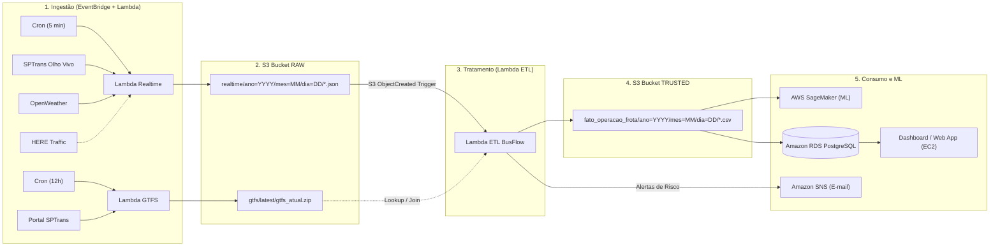

# 🚌 BusFlow - Arquitetura de Dados & Inteligência Operacional

[](https://www.terraform.io/)
[](https://aws.amazon.com/)
[](https://www.python.org/)
[](https://www.postgresql.org/)

O **BusFlow** é uma solução de engenharia de dados e inteligência operacional orientada a eventos para o monitoramento, identificação de gargalos e previsão de déficit de frotas de transporte público urbano na cidade de São Paulo.

---

## 📌 Arquitetura da Solução (Versão V3)

A infraestrutura é 100% provisionada como código (**Terraform**) na **AWS**, seguindo os princípios de Data Lakehouse e arquitetura Serverless:



---

## 📂 Estrutura Padronizada do Repositório

```text
BusFlow/
├── Docs/                              # Documentações técnicas e acadêmicas
│   ├── pipeline_dados_arquitetura_v3.md   # Especificação da arquitetura e camadas RAW/TRUSTED
│   ├── seguranca_gatilhos_e_variaveis.md  # Variáveis centralizadas, segurança e EventBridge
│   ├── exemplo_dataset_trusted_analise.md # Análise matemática e auditoria da camada TRUSTED
│   ├── plano_reorganizacao_repositorio.md # Registro detalhado da reorganização do repositório
│   ├── diagramas/                     # Diagramas visuais organizados
│   │   ├── bpmn/                      # Processos As-Is e To-Be (.bpmn, .svg, .png)
│   │   └── arquitetura/               # Diagramas de arquitetura (.drawio, .svg, .xml)
│   └── tcc/                           # Monografia e relatórios (BusFlow.docx, BusFlow.pdf)
│
├── data/                              # Amostras e dados locais controlados
│   ├── raw/                           # Payloads brutos JSON e ZIPs GTFS
│   │   └── gtfs/                      # Arquivos GTFS SPTrans
│   └── samples/                       # Datasets tratados (fato_operacao_exemplo.csv)
│
├── src/                               # Código-fonte Python da aplicação
│   ├── lambdas/                       # Funções Lambda Serverless da AWS
│   │   ├── ingestion_realtime.py      # Ingestão tempo real (SPTrans + OpenWeather)
│   │   ├── ingestion_gtfs.py          # Ingestão inteligente do GTFS
│   │   └── etl.py                     # Motor ETL de cálculo de índices operacionais
│   └── collectors_local/              # Scripts auxiliares para execução local
│       ├── coletor_tempo_real.py      # Coletor local Olho Vivo + Clima
│       └── coletor_gtfs.py            # Coletor local GTFS
│
├── terraform/                         # Infraestrutura como Código (IaC)
│   ├── main.tf                        # Módulo raiz da arquitetura AWS
│   ├── variables.tf                   # Declaração centralizada de variáveis
│   ├── outputs.tf                     # Outputs de recursos provisionados
│   ├── terraform.tfvars.example       # Template seguro para credenciais
│   └── modules/                       # Módulos: ec2, lambda, network, rds, s3, sagemaker, sns
│
├── .env.example                       # Template de variáveis de ambiente locais
├── .gitignore                         # Regras rigorosas de proteção de segredos
└── README.md                          # Portal central de documentação e onboarding
```

---

## 📐 Modelagem de Dados e Sub-índices (Camada TRUSTED)

O dataset gerado na camada **TRUSTED** (`fato_operacao_frota`) foi projetado para modelos de **Machine Learning**, fornecendo tanto variáveis de entrada quanto sub-índices explicáveis:

| Sub-índice / Métrica | Origem / Fórmula | Descrição |
| :--- | :--- | :--- |
| **$IAC$ / $GC$** *(Gargalo Climático)* | $(\text{Chuva} \times 0.35) + (\text{Visib.} \times 0.20) + (\text{Vento} \times 0.20) + (\text{Temp.} \times 0.15) + (\text{Evento} \times 0.10)$ | Impacto das intempéries na via ($0 - 100$). |
| **$GT$ / $IIV$** *(Impacto Viário)* | $(0.70 \times \text{FLOW}) + (0.25 \times \text{INC}) + (0.05 \times \text{TEND})$ | Nível de congestionamento e incidentes da via ($0 - 100$). |
| **$HP$** *(Horário de Pico)* | Classificação horária: `0.8` (Pico), `0.5` (Exaustivo), `0.2` (Tranquilo) | Sensibilidade da faixa de horário. |
| **$AC$** *(Aderência ao Cronograma)* | $\min(1.0, \frac{\text{Headway Planejado}}{\text{Headway Real}})$ | Proximidade da operação real ao planejado no GTFS ($0 - 1$). |
| **$DFI$** *(Demanda de Frota Ideal)* | $\min(100\%, \frac{\text{Frota Necessária Estimada}}{\text{Frota Ativa Real}} \times 50)$ | Risco de subdimensionamento da frota ($0 - 100\%$). |
| **$GO$** *(Gargalo Operacional Geral)* | $(0.15 \times HP) + (0.25 \times \frac{IAC}{100}) + (0.25 \times \frac{IIV}{100}) + (0.25 \times \frac{DFI}{100}) + (0.10 \times (1 - AC))$ | Índice consolidado ($0.0 - 1.0$) para classificação de risco. |
| **Target Operacional** | Regra / Classificação | *Estabilizado*, *Risco*, *Alto Risco* ou *Congestionamento*. |

---

## 🚀 Como Executar e Implantar

### 1. Configurar Variáveis de Ambiente
Copie o template de variáveis do Terraform e configure suas credenciais:
```bash
cd terraform
cp terraform.tfvars.example terraform.tfvars
```
Edite o arquivo `terraform.tfvars` preenchendo as chaves da SPTrans, OpenWeather e lista de e-mails do SNS.

### 2. Implantar Infraestrutura na AWS
```bash
cd terraform
terraform init
terraform apply -auto-approve
```

### 3. Teste Manual dos Gatilhos (Sob Demanda)

* **Executar Ingestão GTFS:**
  ```bash
  aws lambda invoke --function-name <lambda_ingestion_gtfs_arn> --payload '{}' response.json
  ```
* **Executar Ingestão Tempo Real (Dispara o ETL automaticamente no S3):**
  ```bash
  aws lambda invoke --function-name <lambda_ingestion_arn> --payload '{}' response.json
  ```
* **Verificar Logs do ETL:**
  ```bash
  aws logs tail /aws/lambda/<lambda_etl_arn> --since 5m
  ```

---

## 📄 Documentações do Projeto
* [Especificação do Pipeline e Tabela TRUSTED](Docs/pipeline_dados_arquitetura_v3.md)
* [Guia de Segurança, Variáveis e Gatilhos](Docs/seguranca_gatilhos_e_variaveis.md)
* [Análise e Exemplo Prático da Tabela TRUSTED](Docs/exemplo_dataset_trusted_analise.md)
* [Plano de Reorganização e Registro de Mudanças](Docs/plano_reorganizacao_repositorio.md)
