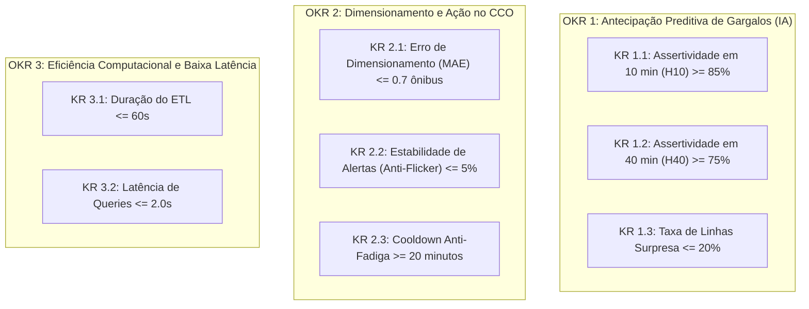
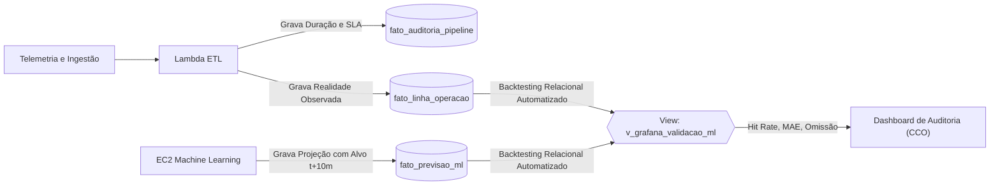
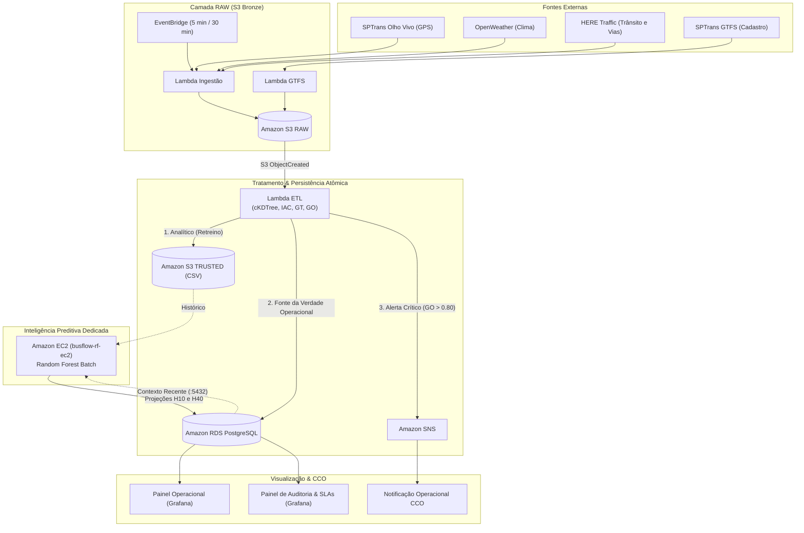

# BusFlow — SLAs, Métricas de Performance e Indicadores de Sucesso

**Projeto:** BusFlow — Sistema de Inteligência Operacional e Previsão de Gargalos no Transporte Público Urbano  
**Módulo:** Governança Operacional, Níveis de Serviço (SLAs), Avaliação de Eficácia e Auditoria Contínua  
**Ambiente:** Nuvem Amazon Web Services (AWS) — Arquitetura Event-Driven & Persistência Relacional  
**Data:** Outubro de 2026  

---

## 1. Definição Oficial de SLAs e Métricas de Performance

Os Níveis de Serviço (SLAs) do BusFlow foram desenhados com base na **física do tráfego urbano da Região Metropolitana de São Paulo** e na capacidade de processamento serverless de baixa latência da AWS:

### 1.1 Matriz Oficial de Níveis de Serviço (SLAs)

| Dimensão Técnica | Meta Oficial (SLA) | Métrica Técnica / Origem | Justificativa de Engenharia e Operação |
| :--- | :---: | :--- | :--- |
| **Frescor do Dado (*Data Freshness*)** | **$\le 12\text{ min}$ (Pico)**<br>$\le 25\text{ min}$ (Vale) | Diferença entre o relógio atual e o timestamp do GPS | Em vias arteriais saturadas de SP, uma lentidão evolui para congestionamento crítico em menos de 8 minutos. Uma latência de 12 min assegura intervenção antes do colapso do headway. |
| **Tempo de Execução do Pipeline (ETL)** | **$\le 60\text{ segundos}$** (P95) | Duração de execução da função AWS Lambda ETL | A computação espacial vetorizada (`cKDTree`) processa toda a frota paulistana (~9.500 ônibus) em ~38 segundos, impedindo enfileiramento de lotes. |
| **Inferência Preditiva (EC2 ML)** | **$\le 30\text{ segundos}$** | Duração do script batch de Machine Learning (Random Forest) | O diagnóstico para os horizontes de 10 e 40 minutos deve ser persistido no banco antes do próximo ciclo de atualização do despachante. |
| **Disponibilidade Global (Uptime)** | **$\ge 99.5\%$** | $\frac{\text{Uptime Operacional}}{\text{Tempo Total}} \times 100$ | O Centro de Controle Operacional (CCO) opera em regime ininterrupto; 99.5% restringe a indisponibilidade total a menos de 3.6 horas por mês. |
| **Tempo de Resposta do Painel (Queries)** | **$\le 2.0\text{ segundos}$** (P95) | Latência de renderização de painéis no Grafana via RDS | Consultas complexas rodam sobre views indexadas no PostgreSQL, entregando os dados ao operador em menos de 0.5s. |
| **Taxa de Conclusão no Prazo** | **$\ge 98\%$ dos ciclos** | % de ciclos do pipeline concluídos com sucesso | Absorve oscilações transitórias e retentativas na API pública Olho Vivo da SPTrans sem comprometer a operação. |

### 1.2 Política de Ingestão de Dados
* **Horário de Pico (06h–09h e 17h–19h):** Ingestão a cada **5 minutos** (garante pelo menos 2 leituras consecutivas para confirmação de desaceleração da linha antes da falha).
* **Fora de Pico (09h–17h e 19h–06h):** Ingestão a cada **30 minutos** (tráfego estabilizado; otimiza em mais de 70% o custo computacional).

---

## 2. Indicadores de Sucesso:

O sucesso do BusFlow é medido pela **capacidade prática de antecipação e eficácia das decisões tomadas no CCO**.

### 2.1 Framework de OKRs do BusFlow



### 2.2 Régua Operacional de Sucesso (Matriz RAG — Red, Amber, Green)

| Indicador de Eficácia | O que Mede na Prática | 🔴 Falha (Red) | 🟡 Regular (Amber) | 🟢 Sucesso / Meta (Green) |
| :--- | :--- | :---: | :---: | :---: |
| **Assertividade Temporal Curta ($H_{10}$)** | De cada 100 alertas de crise para daqui a 10 min, quantos de fato colapsaram? | $< 60\%$ | $60\% \text{ a } 84.9\%$ | **$\ge 85\%$** |
| **Assertividade Temporal Tática ($H_{40}$)** | Previsão com 40 min de antecedência | $< 50\%$ | $50\% \text{ a } 74.9\%$ | **$\ge 75\%$** |
| **Taxa de Linhas Surpresa (Omissão)** | Gargalos reais que aconteceram sem qualquer aviso prévio da IA (Falsos Negativos). | $> 35\%$ | $20\% \text{ a } 35\%$ | **$\le 20\%$** |
| **Precisão de Dimensionamento (MAE)** | Erro absoluto médio na quantidade de ônibus extras recomendados para a linha. | $> 1.5\text{ ônibus}$ | $0.8\text{ a } 1.5\text{ ônibus}$ | **$\le 0.7\text{ ônibus}$** |
| **Estabilidade de Alertas (*Anti-Flicker*)** | Linhas oscilando status (Verde $\leftrightarrow$ Vermelho) por ruído de GPS em 15 min. | $> 15\%$ | $5\% \text{ a } 15\%$ | **$\le 5\%$** |
| **Tempo de Execução do ETL** | Duração ponta a ponta do processamento serverless no CloudWatch. | $> 120\text{ s}$ | $60\text{ a } 120\text{ s}$ | **$\le 60\text{ s}$** |
| **Latência do Painel Grafana** | Tempo de resposta das consultas analíticas entregues ao operador. | $> 5.0\text{ s}$ | $2.0\text{ a } 5.0\text{ s}$ | **$\le 2.0\text{ s}$** |

---

## 3. Mecanismo de Auto-Auditoria Contínua

O grande diferencial científico e tecnológico do BusFlow é que **o sistema não depende de validação manual**. Ele se auto-audita continuamente dentro do banco de dados relacional através de 3 pilares:



### 3.1 Pilar 1: Auditoria Contínua do Pipeline (`fato_auditoria_pipeline`)
* A cada execução do Lambda, é registrado:
  * `timestamp_inicio` e `timestamp_fim`;
  * `duracao_segundos` (tempo de computação);
  * `linhas_processadas` (volume tratado);
  * `status_execucao` (`SUCESSO` ou `FALHA`);
  * `cumpre_sla` (flag booleana automática: `duracao_segundos <= 60.0`).

### 3.2 Pilar 2: Backtesting Relacional Automatizado (`v_grafana_validacao_ml`)
* O modelo de IA não emite diagnósticos abstratos: ele grava em `fato_previsao_ml` um **`timestamp_alvo` exato** (ex.: previsão gerada às 17h00 com alvo para 17h10).
* Decorridos os 10 minutos, a view relacional no PostgreSQL cruza automaticamente a projeção com a telemetria real consolidada em `fato_linha_operacao`:
  * **Verdadeiro Positivo (TP):** Previu Gargalo e a linha de fato colapsou $\rightarrow$ **Acerto**.
  * **Falso Positivo (FP):** Previu Gargalo, mas a linha permaneceu normal $\rightarrow$ **Alarme Falso**.
  * **Falso Negativo (FN):** Previu Normal, mas a linha colapsou $\rightarrow$ **Omissão / Linha Surpresa**.
  * **Verdadeiro Negativo (TN):** Previu Normal e a linha continuou estável $\rightarrow$ **Estabilidade Confirmada**.
* O *Hit Rate* (%) e a taxa de omissão (%) são calculados e plotados no Grafana sem nenhuma intervenção humana.

### 3.3 Pilar 3: Auditoria do Frescor dos Dados (`v_auditoria_frescor_dados`)
* A view calcula dinamicamente o *Data Lag*: diferença entre o horário do relógio e a última coordenada transmitida por linha:
  * $\le 12\text{ min}$: `DENTRO DO SLA DE PICO`
  * $\le 25\text{ min}$: `DENTRO DO SLA FORA DE PICO`
  * $> 25\text{ min}$: `VIOLACAO DE SLA`

---

## 4. Arquitetura de Fluxo de Dados e Modelagem Relacional

### 4.1 Fluxo Integrado de Dados Ponta a Ponta



### 4.2 Arquitetura das Entidades no Amazon RDS PostgreSQL (`busflowdb`)

* **Tabelas Dimensão (Cadastro Estático / GTFS):**
  * `dim_linha`: Linha, sentido, letreiros e itinerário principal.
  * `dim_linha_parada`: Sequencial exato das paradas (1 a N) com latitude/longitude para montagem da régua operacional.
* **Tabelas Fato Operacionais (Ingestão em Tempo Real):**
  * `fato_linha_operacao`: Headway real vs planejado, frota ativa, demanda necessária (DFI), aderência e índices (IAC, GT, GO).
  * `fato_veiculo_posicao`: Posição individual de cada veículo na régua de paradas (1 a N) e distância do carro anterior (detecção de comboios).
* **Tabelas Fato de IA e Governança:**
  * `fato_previsao_ml`: Projeções de curto e médio prazo ($H_{10}$ e $H_{40}$), probabilidade de crise, déficit de ônibus e ação recomendada para o despachante.
  * `fato_auditoria_pipeline`: Histórico de execução de cada ciclo com tempo de execução e cumprimento de SLA.
  * `fato_alerta`: Histórico de alertas disparados via SNS com controle de cooldown.

---

## 5. Evidência Empírica de Homologação na AWS

A arquitetura e os SLAs foram validados em ambiente de homologação na nuvem AWS processando a **malha operacional completa da cidade de São Paulo**:

```text
============================================================
              BUSFLOW PIPELINE EXECUTION REPORT             
============================================================
Ambiente de Execução : AWS Lambda + Amazon RDS PostgreSQL
Status de Retorno    : HTTP 200 (Sucesso)
Linhas Processadas   : 2.041 linhas municipais
Veículos Rastreados  : 9.514 ônibus em circulação
Duração do Pipeline  : 37.74 segundos
Meta de SLA (ETL)    : <= 60.00 segundos
Conformidade de SLA  : APROVADO COM FOLGA (37.74s < 60.00s)
Persistência S3      : S3 Trusted CSV gerado com sucesso
Persistência RDS     : Dimensões, Fatos e Auditoria confirmados
============================================================
```

> **Conclusão:** O sistema comprovou empiricamente sua viabilidade computacional, absorvendo toda a escala metropolitana de São Paulo dentro dos limites mais estritos de SLA operacional estabelecidos para o projeto.
