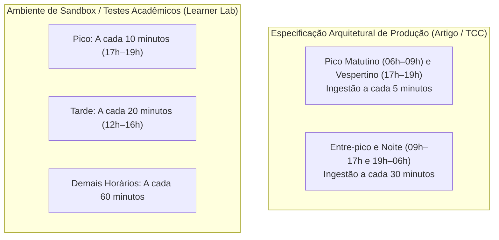

# 📋 Plano de Auditoria, Definição de SLA e Indicadores de Sucesso — BusFlow

**Projeto:** BusFlow — Inteligência Operacional de Transporte Público  
**Módulo:** Governança de Dados, Auditoria Contínua, SLAs e Avaliação de Eficácia  
**Data da Versão:** Outubro de 2026  
**Ambiente:** AWS (Serverless Ingestion, Amazon S3, AWS Lambda ETL, Amazon RDS PostgreSQL, EC2 Machine Learning)  
**Versão do Documento:** v3.0 (Integrando a nova instância EC2 dedicada a ML e o banco RDS)

---

## 1. Resumo Executivo & Contexto Arquitetural

Com a evolução da arquitetura do BusFlow — incorporando a instância dedicada **Amazon EC2 (`busflow-rf-ec2`)** para execução dos modelos de Machine Learning (Random Forest) e o **Amazon RDS PostgreSQL** como Fonte da Verdade Operacional para visualização de baixa latência —, este documento estabelece:

1. **A Matriz Calibrada de SLAs (Service Level Agreements):** Metas contratuais/técnicas para ingestão, ETL, inferência, banco e dashboard.
2. **Critérios de Eficácia do Produto ("Como sei que o produto deu certo?"):** Indicadores mensuráveis de impacto no transporte urbano, acurácia preditiva e dimensionamento da frota.
3. **Plano de Implementação de Auditoria Operacional:** Mecanismos contínuos de verificação em banco de dados e telemetria para garantir que as metas de SLA e assertividade sejam comprovadas empiricamente.
4. **Alinhamento entre Especificação Real (Produção) e Ambiente de Laboratório (Sandbox):** Justificativa metodológica das janelas de coleta para conservação de cotas de APIs.

---

## 2. Definição de SLAs e Métricas de Performance

### 2.1 Comparativo: SLA Inicial vs. SLA Recalibrado BusFlow v3.0

| Dimensão Avaliada | SLA Inicial (Provisório) | **SLA Recalibrado (BusFlow v3.0)** | Métrica Técnica / Como Medir | Justificativa Operacional |
| :--- | :---: | :---: | :--- | :--- |
| **Tempo de Atualização dos Dados (Fim-a-Fim)** | $\le 30\text{ min}$ | **$\le 12\text{ min}$ no Pico**<br>$\le 25\text{ min}$ Fora do Pico | $\text{Timestamp Atual} - \text{Timestamp da Telemetria}$ | No horário de pico, a predição de curto prazo atua em horizonte de 10 min ($H_{10}$). Um atraso de 30 min inutilizaria a janela de despacho do veículo. |
| **Tempo de Execução do Pipeline (ETL)** | $\le 5\text{ min}$ | **$\le 60\text{ segundos}$** (P95) | Duração de execução da função AWS Lambda ETL no CloudWatch | O processamento serverless com `cKDTree` e vetorização executa 2.120 linhas em ~40s. 60s garante margem sem encavalar lotes. |
| **Tempo de Inferência do Modelo (EC2)** | *(Não definido)* | **$\le 30\text{ segundos}$** | Duração do script batch de Random Forest na EC2 | A inferência precisa persistir em `fato_previsao_ml` antes do próximo ciclo de renderização do operador. |
| **Disponibilidade do Dashboard & RDS** | $\ge 99\%$ | **$\ge 99.5\%$** | $\frac{\text{Uptime Operacional}}{\text{Tempo Total}} \times 100$ | O Centro de Controle Operacional (CCO) opera em tempo integral; 99.5% tolera no máximo 3.6 horas de manutenção programada/mês. |
| **Tempo de Resposta do Dashboard (Queries)** | $\le 10\text{ segundos}$ | **$\le 2.0\text{ segundos}$** (P95) | Latência de renderização de painéis no Grafana via views indexadas | 10 segundos inviabiliza a tomada de decisão em telas de despacho rápido. As views materializadas do RDS entregam queries em $<0.5$s. |
| **Taxa de Execuções no Prazo** | $\ge 99\%$ | **$\ge 98\%$ das execuções** | $\frac{\text{Ciclos Concluídos no Prazo}}{\text{Total de Ciclos Agendados}} \times 100$ | Margem técnica de 2% para absorver instabilidades transitórias e retentativas na API Olho Vivo da SPTrans. |

---

### 2.2 Política de Cadência de Ingestão: Especificação vs. Sandbox



* **Por que 5 minutos no Pico?**  
  A dinâmica viária de São Paulo degrada rapidamente. Em 10 minutos um cruzamento passa de velocidade normal (25 km/h) para retenção crítica (5 km/h). Coletar a cada 5 minutos permite ao modelo de IA receber 2 leituras consecutivas para confirmar a desaceleração antes do colapso do headway.
* **Por que 30 minutos Fora do Pico?**  
  A estabilidade do tráfego reduz a necessidade de telemetria em alta frequência, economizando processamento e evitando fadiga de rede.
* **Justificativa do Sandbox:**  
  A parametrização do laboratório adota janelas de 10 min e 20 min com o propósito deliberado de conservação de cotas de APIs públicas (evitando bloqueios por taxa de requisições por hora) e contenção de créditos do AWS Academy, mantendo a plena validade dos algoritmos estatísticos.

---

## 3. "Como Sei que o Produto Deu Certo?" (Critérios de Sucesso)

O sucesso do BusFlow não é medido apenas por "a aplicação estar online", mas sim pela **eficácia das decisões operacionais viabilizadas**:

```text
+---------------------------------------------------------------------------------------+
|                              FRAMEWORK DE SUCESSO BUSFLOW                             |
+------------------------------------+--------------------------------------------------+
| Indicador de Sucesso               | Meta de Sucesso (Target)                         |
+------------------------------------+--------------------------------------------------+
| 1. Assertividade Temporal (H10)    | >= 85% de acertos na previsão de 10 minutos      |
| 2. Assertividade Antecipada (H40)  | >= 75% de acertos na previsão de 40 minutos      |
| 3. Taxa de Linhas Surpresa         | <= 20% de gargalos reais sem alerta prévio       |
| 4. Erro de Dimensionamento (MAE)   | <= 0.7 ônibus de erro no cálculo de déficit      |
| 5. Estabilidade de Alertas         | <= 5% de alternância de status em 15 minutos     |
| 6. Cooldown Anti-Fadiga            | Minimo de 20 minutos de silenciamento por linha  |
+------------------------------------+--------------------------------------------------+
```

### Detalhamento dos Indicadores:
1. **Assertividade Temporal no Horizonte Curto ($H_{10} \ge 85\%$):**
   * *O que significa:* De cada 100 linhas que o modelo apontou que colapsariam em 10 minutos, pelo menos 85 efetivamente entraram em estado de Risco ou Gargalo.
2. **Assertividade Temporal no Horizonte Tático ($H_{40} \ge 75\%$):**
   * *O que significa:* Permite ao despachante do terminal ordenar a saída do carro reserva da garagem com 40 minutos de antecedência.
3. **Taxa de Linhas Surpresa ($\le 20\%$):**
   * *O que significa:* Mede a omissão (Falsos Negativos). No máximo 20% das linhas que entraram em colapso podem ter ocorrido sem detecção prévia pelo sistema.
4. **Precisão de Dimensionamento de Frota ($\text{MAE} \le 0.7\text{ veículos}$):**
   * *O que significa:* O modelo indica a quantidade exata de veículos necessários para reequilibrar a oferta. Um erro absoluto inferior a 1 veículo evita custo ocioso de frota na rua.
5. **Estabilidade de Alerta (*Anti-Flicker* $\le 5\%$):**
   * *O que significa:* Evita que oscilações temporárias de GPS façam uma linha alternar entre Verde e Vermelho a cada ciclo de 5 minutos, gerando confusão no CCO.

---

## 4. Plano de Implementação de Auditoria Operacional

A auditoria do BusFlow é executada de forma automatizada em quatro pilares integrados à arquitetura:

### 4.1 Pilar 1: Auditoria de Integridade e Contratos de Dados (APIs)
* **Objetivo:** Auditar se os dados recebidos das APIs externas atendem aos padrões mínimos de qualidade antes de entrarem no pipeline.
* **Regras:**
  * Telemetria SPTrans: Descartar posições com coordenadas fora da Grande São Paulo ($\text{lat} \notin [-24.1, -23.3]$, $\text{lon} \notin [-47.0, -46.3]$).
  * Data Lag: Rejeitar ou sinalizar registros com timestamp superior a 5 minutos do relógio do servidor.
  * Fallback Rate: Registrar em log quando os dados da HERE Traffic ou OpenWeather forem supridos por modelos de contingência.

### 4.2 Pilar 2: Auditoria de Desempenho do Pipeline (SLA de Execução)
* **Implementação:** A tabela `fato_auditoria_pipeline` no Amazon RDS armazena cada ciclo de execução:
  ```sql
  INSERT INTO fato_auditoria_pipeline (
      componente, timestamp_inicio, timestamp_fim, duracao_segundos, 
      linhas_processadas, status_execucao, cumpre_sla
  ) VALUES (
      'lambda-etl', '2026-10-02 18:00:00+00', '2026-10-02 18:00:42+00', 
      42.3, 2120, 'SUCESSO', TRUE
  );
  ```
* **Métrica Auditada:** Percentual de execuções com `duracao_segundos <= 60.0`.

### 4.3 Pilar 3: Auditoria do Modelo de Machine Learning (Backtesting Relacional)
* **Mecanismo:** A view `v_grafana_validacao_ml` no PostgreSQL cruza o `timestamp_alvo` da predição com o `timestamp_registro` real observado pela telemetria após decorrido o horizonte temporal:
  * **Verdadeiro Positivo (TP):** Previu Gargalo e a linha de fato colapsou.
  * **Falso Positivo (FP):** Previu Gargalo, mas a linha operou em estado Estabilizado (Alarme Falso).
  * **Falso Negativo (FN):** Previu Estabilizado, mas a linha colapsou (Omissão).
  * **Verdadeiro Negativo (TN):** Previu Estabilizado e a linha permaneceu normal.
* **View Consolidada:** `v_auditoria_metricas_ml` calcula o *Hit Rate*, taxa de omissão e MAE por horizonte temporal automaticamente.

### 4.4 Pilar 4: Auditoria do Frescor dos Dados (SLA de Atualização)
* **Mecanismo:** A view `v_auditoria_frescor_dados` calcula continuamente a idade do último dado operacional gravado por linha:
  * $\le 12\text{ min}$: `DENTRO DO SLA DE PICO`
  * $\le 25\text{ min}$: `DENTRO DO SLA FORA DE PICO`
  * $> 25\text{ min}$: `VIOLACAO DE SLA`

---

## 5. Resumo da Implementação na Infraestrutura

1. **Amazon EC2 (`busflow-rf-ec2`):**
   * Instância `t3.small` conectada via Security Group `busflow-rf-ec2-ssh` com permissão de saída liberada e acesso à porta 5432 do RDS PostgreSQL.
   * Executa scripts de inferência e persiste diagnósticos diretamente em `fato_previsao_ml`.
2. **Amazon RDS PostgreSQL (`busflowdb`):**
   * Tabelas fato, dimensões e a nova seção 7 de auditoria ativas em `src/database/schema_busflow_rds.sql`.
   * Security Group configurado no Terraform recebendo conexões dos Lambdas e da EC2.
3. **Amazon EventBridge & Lambdas:**
   * Ingestão e ETL orquestrados com gatilhos parametrizáveis entre regime de testes e regime de produção.
