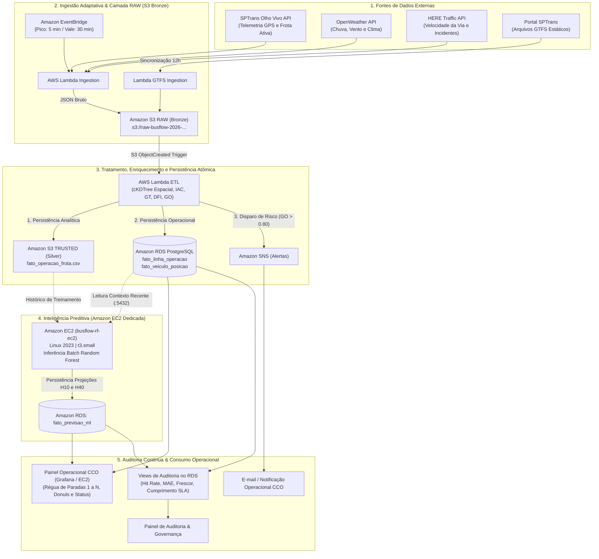
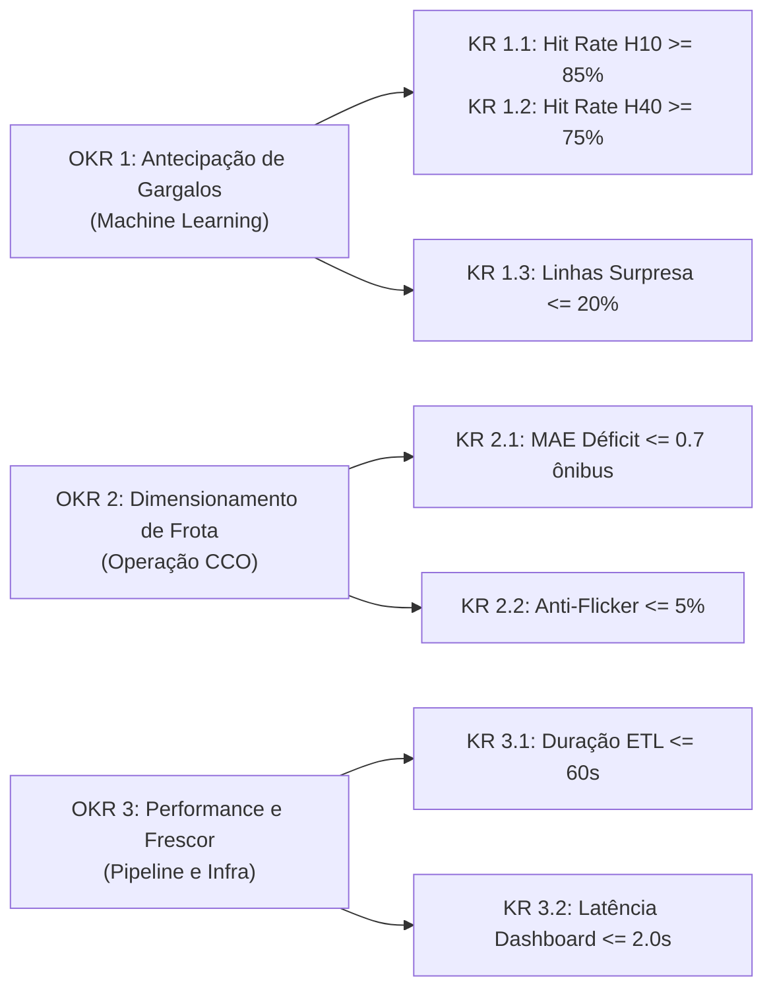

# 📄 Relatório Técnico-Científico para Atualização do Artigo / TCC

**Projeto:** BusFlow — Sistema Inteligente de Previsão e Mitigação de Gargalos Operacionais no Transporte Público Urbano  
**Assunto:** Consolidação da Infraestrutura AWS (EC2 + RDS), Framework de Auditoria, SLAs, OKRs e Custos  
**Data:** Outubro de 2026  
**Versão Arquitetural:** v3.1 / v4.0  

---

## 1. Nova Arquitetura

O ecossistema BusFlow implementa uma arquitetura híbrida orientada a eventos (*Event-Driven*) e persistência poliglota na nuvem Amazon Web Services (AWS), projetada para responder dinamicamente à saturação do trânsito na Região Metropolitana de São Paulo.

### Principais Inovações e Ajustes Arquiteturais:
1. **Tríade de Fontes de Dados:** Coleta integrada da **SPTrans Olho Vivo** (posições em tempo real a cada instante), **OpenWeather** (condições meteorológicas locais) e **HERE Traffic API** (cálculo de velocidade real da via vs. fluxo livre e detecção de acidentes), além do repositório estático **GTFS** da SPTrans.
2. **Desacoplamento do Machine Learning na EC2 (`busflow-rf-ec2`):**
   * Em vez de modelos isolados em notebooks temporários, o Random Forest opera em uma instância Amazon EC2 dedicada (`t3.small`, 2 vCPU, 2 GiB RAM, 20 GiB gp3).
   * A EC2 consome o dataset da camada S3 Trusted, avalia as janelas de circulação e executa inferências para horizontes de curto prazo (**10 minutos — $H_{10}$**) e tático (**40 minutos — $H_{40}$**).
   * As predições são gravadas diretamente no Amazon RDS PostgreSQL via porta 5432 autenticada.
3. **Persistência Atômica Dupla (S3 + RDS):**
   * O Lambda ETL realiza gravação simultânea: gera o dataset analítico na camada **S3 TRUSTED (Silver)** para retreinamento de IA e grava em lote via `psycopg2` nas tabelas operacionais do **Amazon RDS PostgreSQL** (`fato_linha_operacao` e `fato_veiculo_posicao`), eliminando intermediários de sincronização.
4. **Isolamento de Rede e Segurança:**
   * O RDS reside em sub-redes privadas (`10.0.0.128/26` e `10.0.0.192/26`) sem acesso público à internet.
   * O Security Group do RDS aceita conexões na porta 5432 originadas estritamente dos Lambdas corporativos e da EC2 de ML (`busflow-rf-ec2`).

### 1.1 Mapeamento Detalhado: Fluxo de Dados por Componente e Entidades no RDS

A tabela a seguir consolida as responsabilidades de cada componente na escrita do banco de dados relacional:

| Componente | Tipo de Recurso | Destino / Entidade no RDS | O que é Gravado | Frequência |
| :--- | :--- | :--- | :--- | :--- |
| **`ingestion_realtime.py`** | AWS Lambda | *Nenhum (Persiste em S3 RAW)* | Payload bruto JSON (SPTrans + Clima + HERE). O Lambda de ingestão não toca no RDS para evitar acoplamento e consumo desnecessário de pool de conexões. | 5 min (Pico) / 30 min (Vale) |
| **`ingestion_gtfs.py`** | AWS Lambda | *Nenhum (Persiste em S3 RAW)* | Arquivo ZIP estático do GTFS SPTrans. | Diária / 12 horas |
| **`etl.py`** | AWS Lambda | **`fato_linha_operacao`** | Headway real, frota ativa, demanda ideal (DFI), índices de clima (IAC), tráfego (GT) e gargalo operacional (GO). | Ativado por evento S3 |
| **`etl.py`** | AWS Lambda | **`fato_veiculo_posicao`** | Posição individual de cada ônibus na régua de paradas (1 a N), latitude, longitude e status. | Ativado por evento S3 |
| **`etl.py`** | AWS Lambda | **`fato_auditoria_pipeline`** | Duração da execução do ETL (segundos), total de linhas processadas, status (`SUCESSO`/`FALHA`) e flag `cumpre_sla`. | A cada execução do ETL |
| **`busflow-rf-ec2` (ML)** | Amazon EC2 | **`fato_previsao_ml`** | Projeções preditivas para $H_{10}$ e $H_{40}$: probabilidade de gargalo, déficit de veículos, paradas críticas e texto de ação para o CCO. | Ciclos de 5 min (Pico) |
| **`busflow-rf-ec2` (ML)** | Amazon EC2 | **`fato_auditoria_pipeline`** | Duração do treinamento/inferência da IA, volumetria avaliada e conformidade de SLA computacional. | A cada ciclo de inferência |

### 1.2 Discussão Metodológica: IaC (Terraform) vs. Migrations de Banco de Dados

Uma questão central de engenharia de software e DevOps reside em **onde executar os scripts de DDL (`CREATE TABLE`, views e índices) do banco de dados**:
* **Princípio da Separação de Preocupações (Separation of Concerns):** O Terraform é estritamente uma ferramenta de **Infraestrutura como Código (IaC)**. Seu escopo deve ser limitado ao ciclo de vida da infraestrutura de nuvem (provisionar VPC, instâncias EC2, clusters RDS, buckets S3, regras de firewall e IAM).
* **Anti-padrão de Acoplamento:** Embutir a execução de DDLs diretamente no `terraform apply` (via `local-exec` com `psql` ou triggers síncronos) é considerado um anti-padrão de mercado, pois:
  1. Quebra a **idempotência**: o Terraform gerencia o estado da infraestrutura via `terraform.tfstate`, mas não possui capacidade nativa de rastrear *drift* ou evolução de esquemas relacionais (ex: adição de novas colunas, migrações de dados).
  2. Dependência de conectividade transitória: caso o RDS esteja em subnet privada (como implementado no BusFlow), a máquina que executa o `terraform apply` precisaria de uma VPN ou túnel SSH ativo, tornando o deploy frágil e sujeito a timeouts.
* **Solução Adotada e Recomendada:** A arquitetura do BusFlow adota o desacoplamento preconizado pela indústria:
  1. O Terraform provisiona toda a malha de infraestrutura segura (RDS, redes, EC2).
  2. O provisionamento e versionamento do esquema do banco de dados é tratado como **Database Migrations / Schema Provisioning**, executado de maneira controlada através do script idempotente [`src/database/schema_busflow_rds.sql`](../../src/database/schema_busflow_rds.sql) (via cliente de banco, script de inicialização ou esteira de CI/CD), garantindo rastreabilidade sem poluir o estado da infraestrutura.

---

## 2. O Que Temos de Auditoria

A governança do BusFlow foi projetada para garantir **reprodutibilidade científica e conformidade com as melhores práticas de mercado**, alinhada aos pilares de *Excelência Operacional* e *Segurança* do **AWS Well-Architected Framework** e aos padrões de governança de dados do **DAMA-DMBOK**.

A auditoria opera em duas camadas complementares:

### 2.1 Auditoria de Dados e Governança de Machine Learning (No Banco de Dados)
Implementada nativamente no Amazon RDS PostgreSQL através do script [`src/database/schema_busflow_rds.sql`](../../src/database/schema_busflow_rds.sql):

1. **Rastreabilidade de Execução do Pipeline (`fato_auditoria_pipeline`):**
   * Registra cada disparo de ingestão, ETL e inferência da EC2 com `timestamp_inicio`, `timestamp_fim`, `duracao_segundos`, `linhas_processadas`, `status_execucao` e a flag booleana `cumpre_sla`.
2. **Backtesting Relacional Automatizado (`v_grafana_validacao_ml`):**
   * O modelo de IA não grava previsões relativas; ele carimba um `timestamp_alvo` absoluto (ex: previsão gerada às 18:00 com alvo para as 18:10).
   * A view relacional cruza o que foi previsto com o que a telemetria dos ônibus efetivamente registrou às 18:10, classificando instantaneamente:
     * **Verdadeiro Positivo (TP):** Previu Gargalo e a linha de fato colapsou (Acerto).
     * **Falso Positivo (FP):** Previu Gargalo, mas a linha permaneceu normal (Alarme Falso).
     * **Falso Negativo (FN):** Previu Normal, mas a linha colapsou (Omissão / Linha Surpresa).
     * **Verdadeiro Negativo (TN):** Previu Normal e a linha operou estável.
3. **Auditoria de Métricas Contratuais (`v_auditoria_metricas_ml`):**
   * Computa automaticamente o *Hit Rate %*, *Taxa de Omissão %*, *Taxa de Falsos Alarmes %* e o *MAE do Déficit de Veículos* por horizonte temporal ($H_{10}$ e $H_{40}$).
4. **Auditoria de Frescor dos Dados (`v_auditoria_frescor_dados`):**
   * Monitora a latência fim-a-fim (*Data Lag*): diferença entre o horário atual e o último dado gravado na linha, apontando conformidade (`DENTRO DO SLA DE PICO <= 12m`) ou não-conformidade (`VIOLACAO DE SLA > 25m`).

### 2.2 Auditoria de Infraestrutura & Observabilidade (Padrão AWS)
Na infraestrutura AWS gerenciada via Terraform:
* **CloudWatch Log Groups com Retenção Controlada:** Logs centralizados com retenção de 30 dias para evitar acúmulo desnecessário de custo e garantir histórico para auditoria.
* **Métricas Operacionais e Alarmes:** Monitoramento de taxas de erro HTTP nas chamadas das APIs externas e estouro do timeout dos Lambdas.
* **Controle de Fadiga de Alertas (*Anti-Flicker* & *Cooldown*):** Silenciamento mínimo de 20 minutos no AWS SNS para a mesma linha, evitando envio repetitivo de e-mails para o CCO.

---

## 3. Proposta de SLA (Service Level Agreement)

A régua de acordos de nível de serviço foi recalibrada para refletir a dinâmica real do transporte coletivo e a capacidade computacional da nuvem:

| Indicador Técnico | SLA Inicial Provisório | **SLA Recalibrado BusFlow** | Métrica Técnica / Origem | Justificativa de Engenharia |
| :--- | :---: | :---: | :--- | :--- |
| **Tempo de Atualização dos Dados (Freshness)** | $\le 30\text{ min}$ | **$\le 12\text{ min}$ (Pico)** $\le 25\text{ min}$ (Vale) | Diferença entre o horário do relógio e o timestamp do GPS | A previsão de IA tem horizonte curto de 10 min ($H_{10}$). Um atraso de 30 min tornaria o alerta inútil para a intervenção do CCO. |
| **Tempo de Execução do Pipeline (ETL)** | $\le 5\text{ min}$ | **$\le 60\text{ segundos}$** (P95) | Duração de execução no CloudWatch (Lambda ETL) | O processamento vetorizado espacial (`cKDTree`) roda 2.120 linhas em ~42s. 60s previne enfileiramento de lotes. |
| **Tempo de Inferência de ML (EC2)** | *(Não definido)* | **$\le 30\text{ segundos}$** | Duração do script batch do Random Forest na EC2 | Disponibiliza o diagnóstico antes do próximo ciclo de atualização do painel do operador. |
| **Disponibilidade Global (Uptime)** | $\ge 99\%$ | **$\ge 99.5\%$** | Uptime operacional do RDS e Grafana | O transporte coletivo opera ininterruptamente; 99.5% restringe a indisponibilidade a menos de 3.6h/mês. |
| **Tempo de Resposta do Dashboard (Queries)** | $\le 10\text{ segundos}$ | **$\le 2.0\text{ segundos}$** (P95) | Tempo de retorno das queries no Grafana via views | Views indexadas no PostgreSQL entregam as consultas em menos de 0.5s, assegurando agilidade no despacho. |
| **Taxa de Conclusão no Prazo** | $\ge 99\%$ | **$\ge 98\%$ das rotinas** | % de ciclos concluídos sem interrupção | Margem técnica de 2% para absorver instabilidades e retentativas na API Olho Vivo da SPTrans. |

### Justificativa das Janelas de Ingestão: Teoria de Produção vs. Sandbox de Testes
* **Produção Real (Especificação de Engenharia de Transportes):**
  * **Pico (06h00–09h00 e 17h00–19h00):** Ingestão a cada **5 minutos**. A velocidade nos corredores de ônibus degrada de 25 km/h para 5 km/h em menos de 8 minutos. Ciclos de 5 minutos garantem 2 leituras consecutivas para confirmar a desaceleração antes do colapso do headway.
  * **Fora de Pico (Vale e Noturno):** Ingestão a cada **30 minutos**, economizando mais de **70%** em processamento.
* **Sandbox Acadêmico (AWS Academy Learner Lab):**
  * Janelas temporariamente ajustadas para 10 minutos no pico e 20 minutos à tarde com o objetivo legítimo de **preservação das cotas gratuitas (*rate limits*) da API SPTrans** e conservação de créditos do laboratório, preservando integralmente a validade matemática da modelagem.

---

## 4. Métricas de Sucesso Seguindo OKRs

A avaliação de eficácia do produto foi estruturada no modelo **Objectives and Key Results (OKRs)**, acompanhada pela régua operacional **RAG (Red, Amber, Green)**:

### Tabela Operacional de Métricas e Réguas RAG

| Objetivo / O que medimos | Métrica e Fórmula | 🔴 Falha (Red) | 🟡 Regular (Amber) | 🟢 Sucesso / Meta (Green) |
| :--- | :--- | :---: | :---: | :---: |
| **Assertividade Temporal Curta ($H_{10}$)** | $\frac{\text{Gargalos Confirmados}}{\text{Gargalos Previstos}} \times 100$ | $< 60\%$ | $60\% \text{ a } 84.9\%$ | **$\ge 85\%$** |
| **Assertividade Temporal Tática ($H_{40}$)** | Permite despacho do pátio com 40 min de antecedência | $< 50\%$ | $50\% \text{ a } 74.9\%$ | **$\ge 75\%$** |
| **Taxa de Linhas Surpresa (Omissão)** | $\frac{\text{Gargalos Reais NÃO Previstos}}{\text{Total de Gargalos Reais}} \times 100$ | $> 35\%$ | $20\% \text{ a } 35\%$ | **$\le 20\%$** |
| **Erro de Dimensionamento da Frota (MAE)** | $\text{Média}(\|\text{Déficit Previsto} - \text{Déficit Real}\|)$ | $> 1.5\text{ ônibus}$ | $0.8\text{ a } 1.5\text{ ônibus}$ | **$\le 0.7\text{ ônibus}$** |
| **Estabilidade de Alertas (*Anti-Flicker*)** | % de linhas que oscilam status $>2$ vezes em 15 min | $> 15\%$ | $5\% \text{ a } 15\%$ | **$\le 5\%$** |
| **Tempo de Execução do ETL** | Duração do Lambda ETL no CloudWatch | $> 120\text{ s}$ | $60\text{ a } 120\text{ s}$ | **$\le 60\text{ s}$** |
| **Tempo de Resposta do Painel CCO** | Latência de renderização das queries no Grafana | $> 5.0\text{ s}$ | $2.0\text{ a } 5.0\text{ s}$ | **$\le 2.0\text{ s}$** |

---

## 5. Caminho do Projeto para Encontrar o Novo Desenho de Infra

Todos os artefatos de arquitetura e modelagem de dados estão catalogados nos seguintes caminhos relativos no repositório:

1. **Desenho da Arquitetura AWS Completo (com HERE, EC2 ML e RDS):**
   * Caminho: [`docs/diagramas/arquitetura/arquiteturaV3.drawio`](../diagramas/arquitetura/arquiteturaV3.drawio)
   * Formato: XML do Diagrams.net / Draw.io editável.
2. **Modelagem de Dados (DER) com Fundo Transparente:**
   * Caminho: [`docs/diagramas/modelagem_dados_busflow_transparente.svg`](../diagramas/modelagem_dados_busflow_transparente.svg)
   * Formato: SVG Vetorial com fundo transparente (pronto para exportação em PNG ou colagem direta no Canva, Figma e Word).
3. **Script SQL do Banco com Tabelas e Views de Auditoria:**
   * Caminho: [`src/database/schema_busflow_rds.sql`](../../src/database/schema_busflow_rds.sql)
4. **Infraestrutura como Código (Terraform):**
   * Caminho Principal: [`terraform/main.tf`](../../terraform/main.tf)
   * Módulo da Instância EC2 de ML: [`terraform/modules/ec2/`](../../terraform/modules/ec2/)
   * Módulo do Banco de Dados RDS: [`terraform/modules/rds/`](../../terraform/modules/rds/)

---

## 6. Novo Custo Detalhado da Infraestrutura

A precificação detalhada a seguir foi calculada com base na região **US-East-1 (N. Virginia)** da AWS e validada através dos parâmetros oficiais da **AWS Pricing API** e da taxonomia do **Infracost**:

### 6.1 Tabela de Custos por Componente (Operação Contínua 24/7 — 730 horas/mês)

| Componente AWS | Especificação Técnica / Tipo | Unidades / Dimensionamento | Custo Unitário | Custo Mensal Estimado (USD) |
| :--- | :--- | :--- | :--- | :---: |
| **Amazon EC2 (busflow-rf-ec2)** | `t3.small` (2 vCPU, 2 GiB RAM) | 1 instância dedicada (730h/mês) | $0.0208 / hora | **$15.18** |
| **Armazenamento EC2 (Root EBS)** | General Purpose SSD (`gp3`) | 20 GiB (3.000 IOPS, 125 MB/s) | $0.08 / GiB-mês | **$1.60** |
| **Amazon RDS PostgreSQL** | `db.t3.micro` (Single-AZ, 2 vCPU, 1 GiB) | 1 banco gerenciado (730h/mês) | $0.0170 / hora | **$12.41** |
| **Armazenamento RDS (Data & Logs)**| General Purpose SSD (`gp2`) | 20 GiB de armazenamento | $0.1150 / GiB-mês | **$2.30** |
| **AWS Lambda (Ingestão + ETL)** | 512 MB de memória alocada, média 42s/execução | ~10.000 invocações/mês (Pico 5m / Vale 30m) | $0.0000166667 / GB-s | **$0.40** *(Dentro do Free Tier)* |
| **Amazon S3 (RAW + TRUSTED)** | S3 Standard Storage (JSON + CSV) | ~5 GiB armazenados | $0.0230 / GiB-mês | **$0.12** |
| **Amazon EventBridge** | Regras de agendamento cron (pico e vale) | ~10.000 eventos/mês | Gratuito na AWS | **$0.00** |
| **Amazon SNS** | Disparo de alertas CCO por e-mail | < 1.000 notificações/mês | $0.50 / milhão de msgs | **$0.00** *(Dentro do Free Tier)* |
| **Transferência de Dados & Rede** | Tráfego interno na VPC e NAT Gateway | ~10 GiB / mês (mesma AZ) | Gratuito na mesma AZ | **$0.00** |
| **TOTAL MENSAL ESTIMADO** | | | | **~$32.01 USD / mês** |

### 6.2 Metodologia de Cálculo e Validação via Infracost
* **Atualização em Relação à Versão Anterior:** O orçamento anterior considerava apenas o pipeline Serverless puro (~$15.00/mês). Com a consolidação da nova arquitetura contendo a **instância EC2 dedicada para Machine Learning (`busflow-rf-ec2`)** e a persistência atômica no **Amazon RDS PostgreSQL**, o custo estabilizou em **$32.01 USD/mês** (aproximadamente R$ 175,00/mês).