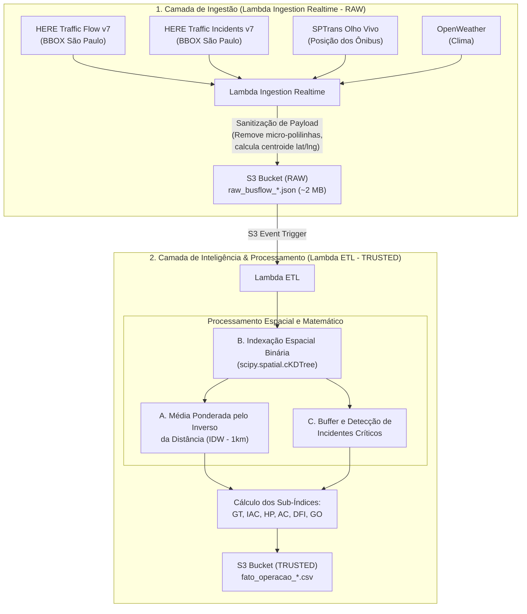

# Especificação Técnica: Fluxo de Dados, Inteligência Espacial e Cálculos da API HERE

**Projeto:** BusFlow - Inteligência Operacional de Transporte Público Urbano  
**Módulo:** Enriquecimento Viário e Gargalo de Tráfego ($GT$ / $IIV$)  
**Versão:** 1.0 (Arquitetura V3)

---

## 1. Visão Geral e Separação de Responsabilidades

Para seguir as melhores práticas de **Engenharia de Dados e Data Lakehouse (Medallion Architecture)**, o fluxo da API HERE foi desacoplado em duas etapas bem definidas:

---

## 2. Por que A, B e C ficam no ETL e NÃO na Ingestão?

| Critério | Ingestão (Camada RAW) | ETL (Camada TRUSTED) |
| :--- | :--- | :--- |
| **Responsabilidade** | Coleta, sanitização e persistência do dado original. | Transformações, inteligência espacial e regras de negócio. |
| **O que executa** | Extrai métricas brutas e reduz tamanho de 98 MB para ~2 MB. | **Executa A (IDW), B (cKDTree) e C (Incidentes).** |
| **Idempotência & Reprocessamento** | Rápida (< 3s), sem dependência entre fontes. | Permite alterar fórmulas ou raios sem gastar novas chamadas da API HERE. |

---

## 3. Detalhamento dos Componentes de Inteligência

### 🟢 Componente B: Indexação Espacial Binária (`cKDTree`)

Para cruzar $\approx 10.000$ ônibus ativos com $\approx 20.000$ trechos viários da HERE a cada 5 minutos sem estourar o tempo da Lambda, o ETL utiliza a estrutura de dados **$k$-d Tree (k-dimensional tree)**:

1. **Construção da Árvore:**
   * Os centroides de todos os trechos da HERE são convertidos em coordenadas cartesianas/angulares e indexados em uma árvore binária espacial em $\mathcal{O}(N \log N)$.
2. **Consulta por Raio ($r = 1\text{ km}$):**
   * Para cada ônibus $(lat_{bus}, lng_{bus})$, a busca por vizinhos no raio de 1 km é executada em $\mathcal{O}(\log N)$, levando **menos de 0.05 segundos** para toda a frota da cidade.

---

### 🟢 Componente A: Média Ponderada pelo Inverso da Distância (IDW)

Para evitar que o trânsito de uma rodovia ou marginal a 800m de distância contamine indevidamente uma linha que roda em uma avenida de bairro paralela, aplicamos o **Inverse Distance Weighting (IDW)**:

#### Fórmula Matemática:
Para um conjunto de $k$ trechos da HERE encontrados dentro do raio $r \le 1\text{ km}$ do veículo, com distâncias $d_i$ (em km):

$$w_i = \frac{1}{(d_i + \epsilon)^p}$$

Onde:
* $d_i$: Distância geodésica (Haversine/Euclidiana) entre o ônibus e o trecho $i$.
* $\epsilon = 0.01\text{ km}$ ($10\text{ m}$): Fator de suavização para evitar divisão por zero quando o ônibus está exatamente sobre o sensor.
* $p = 2$: Potência de decaimento quadrático da distância.

#### Cálculo das Métricas Ponderadas da Linha:

$$\text{jam\_factor}_{\text{veículo}} = \frac{\sum_{i=1}^{k} w_i \cdot \text{jamFactor}_i}{\sum_{i=1}^{k} w_i}$$

$$\text{velocidade\_via}_{\text{veículo}} = \frac{\sum_{i=1}^{k} w_i \cdot \text{speed}_i}{\sum_{i=1}^{k} w_i}$$

$$\text{velocidade\_freeflow}_{\text{veículo}} = \frac{\sum_{i=1}^{k} w_i \cdot \text{freeFlow}_i}{\sum_{i=1}^{k} w_i}$$

> **Resultado:** Um trecho a $50\text{ metros}$ possui peso **$324 \times$ maior** que um trecho a $900\text{ metros}$, garantindo precisão cirúrgica no corredor de circulação.

---

### 🟢 Componente C: Detecção e Buffer de Incidentes Críticos

Incidentes reportados pela HERE Traffic API (acidentes, alagamentos, obras com interdição total de pista) alteram drasticamente o comportamento das linhas de ônibus.

#### Regra de Classificação:
Para cada linha de ônibus, verificamos todos os incidentes que interceptam o raio de 1 km dos seus veículos ativos:

$$\text{incidente\_critico} = \begin{cases} 
1, & \text{se } \exists \text{ incidente com } (\text{roadClosed} = \text{True} \lor \text{criticality} \in \{\text{"critical"}, \text{"major"}\}) \\
0, & \text{caso contrário}
\end{cases}$$

---

## 4. Integração no Cálculo do Gargalo de Tráfego ($GT$)

Com os valores de `jam_factor`, velocidades e incidentes calculados com precisão espacial para cada linha, o sub-índice $GT$ é consolidado no ETL:

$$GT = (0.70 \times \text{FLOW}) + (0.25 \times \text{INC}) + (0.05 \times \text{TEND})$$

Onde:
* $\text{FLOW} = \min(100.0, \, \text{jam\_factor} \times 10.0)$
* $\text{INC} = \begin{cases} 100.0, & \text{se } \text{incidente\_critico} = 1 \text{ e via fechada} \\ 60.0, & \text{se } \text{incidente\_critico} = 1 \text{ sem bloqueio total} \\ 0.0, & \text{se sem incidentes} \end{cases}$
* $\text{TEND} = 50.0$ (Estável)

---

## 5. Dicionário de Campos Gerados para a Tabela TRUSTED

Os campos enriquecidos da HERE são inseridos diretamente no dataset consolidado (`fato_operacao_*.csv`):

| Campo no CSV | Tipo | Descrição |
| :--- | :--- | :--- |
| `jam_factor` | `FLOAT` (0.0 a 10.0) | Nível de congestionamento ponderado (IDW) do trajeto da linha. |
| `velocidade_via_kmh` | `FLOAT` | Velocidade real média dos veículos na via ($km/h$). |
| `velocidade_freeflow_kmh` | `FLOAT` | Velocidade de fluxo livre na via ($km/h$). |
| `incidente_critico` | `INT` (0 ou 1) | Flag indicando bloqueio ou acidente grave no raio da linha. |
| `gt_gargalo_trafego` | `FLOAT` (0 a 100) | Índice ponderado de Gargalo de Tráfego ($GT$). |
