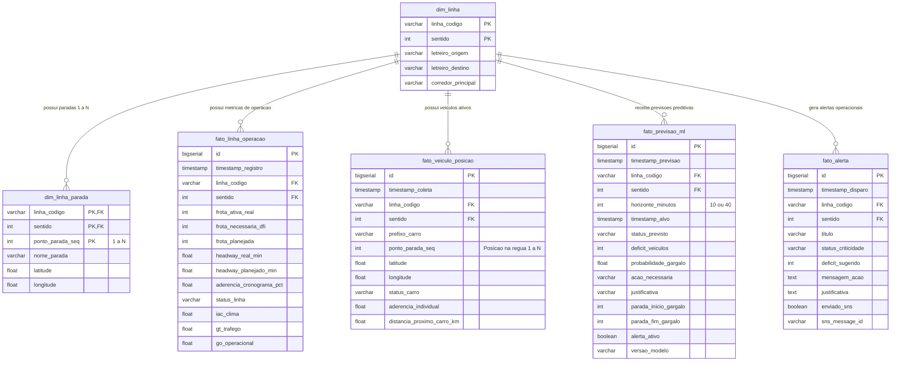

# Especificacao Tecnica: Modelagem de Dados do Amazon RDS PostgreSQL

**Projeto:** BusFlow - Inteligencia Operacional de Transporte Publico  
**Modulo:** Camada de Consumo e Banco Relacional (Amazon RDS)  
**Banco:** busflowdb | **Motor:** PostgreSQL 14+  
**Versao:** 2.0 (Alinhada aos Paineis de Observabilidade e Machine Learning)

---

## 1. Visao Geral da Arquitetura de Dados no RDS

O Amazon RDS PostgreSQL atua como a **Fonte Unica da Verdade Operacional** para o consumo em tempo real pelo Grafana e pelo modulo de Machine Learning.

O modelo foi projetado com segregacao estrita de responsabilidades:
* **Tabelas Dimensao:** Dados cadastrais estaticos e semi-estaticos derivados do GTFS da SPTrans (linhas e sequenciamento de paradas).
* **Tabelas Fato:** Dados operacionais ingeridos a cada ciclo de 5 minutos, divididos no nivel agregado de linha e no nivel desagregado de veiculo (carro).
* **Tabelas de Inteligencia Artificial:** Diagnosticos preditivos emitidos pelo modelo com horizontes temporais de 10 e 40 minutos.
* **Tabelas de Mensageria:** Registro historico de alertas para auditoria e controle de notificacoes AWS SNS.
* **Views Otimizadas:** Consultas pre-compiladas para abastecer diretamente os paineis do Grafana com latencia inferior a 0.5 segundo.

---

## 2. Diagrama Entidade-Relacionamento (DER)



---

## 3. Dicionario de Dados Detalhado

### 3.1 Tabela `dim_linha`
Armazena o cadastro unico das linhas municipais monitoradas.
* `linha_codigo` (VARCHAR(20), PK): Codigo operacional da linha (ex: `5023-10`, `5030-10`).
* `sentido` (INT, PK): Sentido da viagem (1: Ida/Terminal Principal, 2: Volta/Terminal Secundario).
* `letreiro_origem` (VARCHAR(100)): Nome descritivo do terminal de partida.
* `letreiro_destino` (VARCHAR(100)): Nome descritivo do terminal de chegada.
* `corredor_principal` (VARCHAR(100)): Eixo viario predominante de circulacao da linha.

### 3.2 Tabela `dim_linha_parada`
Armazena a sequencia dinamica de pontos de parada de cada linha ($1 \dots N$), permitindo a construcao do diagrama linear de circulacao.
* `linha_codigo` (VARCHAR(20), PK, FK): Chave estrangeira para `dim_linha`.
* `sentido` (INT, PK, FK): Sentido da operacao correspondente.
* `ponto_parada_seq` (INT, PK): Ordem sequencial do ponto de parada no trajeto, iniciando em 1 e terminando em $N$.
* `nome_parada` (VARCHAR(150)): Identificacao ou endereco de referencia do ponto.
* `latitude` (FLOAT): Latitude geografica do ponto de parada.
* `longitude` (FLOAT): Longitude geografica do ponto de parada.

### 3.3 Tabela `fato_linha_operacao`
Consolida o estado de cada linha a cada ciclo de 5 minutos, alimentando os graficos macro da cidade.
* `id` (BIGSERIAL, PK): Identificador unico do registro.
* `timestamp_registro` (TIMESTAMP WITH TIME ZONE): Instante UTC de gravacao do ciclo.
* `linha_codigo` (VARCHAR(20), FK): Codigo da linha.
* `sentido` (INT, FK): Sentido da operacao.
* `frota_ativa_real` (INT): Quantidade de onibus transmitindo GPS no momento da captura (Demanda Real).
* `frota_necessaria_dfi` (INT): Quantidade ideal calculada pelo modelo/ETL sob condicoes de chuva e transito (Demanda Ideal).
* `frota_planejada` (INT): Quantidade de onibus programada no quadro horario do GTFS.
* `headway_real_min` (FLOAT): Intervalo medio observado entre veiculos consecutivos.
* `headway_planejado_min` (FLOAT): Intervalo programado pelo planejamento teorico.
* `aderencia_cronograma_pct` (FLOAT): Percentual de pontualidade e regularidade ($0.0\%$ a $100.0\%$).
* `status_linha` (VARCHAR(30)): Classificacao operacional (`Estabilizado`, `Risco de Gargalo`, `Gargalo`).
* `iac_clima` (FLOAT): Indice de impacto meteorologico ($0$ a $100$).
* `gt_trafego` (FLOAT): Indice de lentidao viaria HERE Traffic ($0$ a $100$).
* `go_operacional` (FLOAT): Score sintetico ponderado do gargalo operacional ($0.0$ a $1.0$).

### 3.4 Tabela `fato_veiculo_posicao`
Armazena a posicao e aderencia de cada veiculo individual ativo na linha a cada ciclo de 5 minutos.
* `id` (BIGSERIAL, PK): Identificador unico do registro.
* `timestamp_coleta` (TIMESTAMP WITH TIME ZONE): Instante UTC da telemetria do veiculo.
* `linha_codigo` (VARCHAR(20), FK): Linha em que o veiculo esta prestando servico.
* `sentido` (INT, FK): Sentido da viagem em execucao.
* `prefixo_carro` (VARCHAR(20)): Identificador do onibus formatado para exibicao (ex: `Carro 03`, `Carro 09`).
* `ponto_parada_seq` (INT): Posicao na regua de paradas ($1 \dots N$) correspondente a parada mais proxima via busca espacial euclidiana.
* `latitude` (FLOAT): Coordenada GPS de latitude do onibus.
* `longitude` (FLOAT): Coordenada GPS de longitude do onibus.
* `status_carro` (VARCHAR(30)): Classificacao individual do veiculo (`Estabilizado`, `Risco de Gargalo`, `Gargalo`).
* `aderencia_individual` (FLOAT): Regularidade calculada do veiculo ($0.0$ a $1.0$).
* `distancia_proximo_carro_km` (FLOAT): Espacamento em quilometros para o carro a frente (deteccao de comboio).

### 3.5 Tabela `fato_previsao_ml`
Destino padronizado para onde o modelo preditivo (SageMaker / XGBoost) grava suas inferencias.
* `id` (BIGSERIAL, PK): Identificador da inferencia preditiva.
* `timestamp_previsao` (TIMESTAMP WITH TIME ZONE): Momento exato em que o modelo executou a inferencia.
* `linha_codigo` (VARCHAR(20), FK): Linha avaliada.
* `sentido` (INT, FK): Sentido da linha.
* `horizonte_minutos` (INT): Janela temporal projetada (10 ou 40 minutos).
* `timestamp_alvo` (TIMESTAMP WITH TIME ZONE): Momento exato para o qual a previsao e valida ($timestamp\_previsao + horizonte$).
* `status_previsto` (VARCHAR(30)): Cenario projetado pela IA (`Estabilizado`, `Risco de Gargalo`, `Gargalo`).
* `deficit_veiculos` (INT): Quantidade recomendada de veiculos adicionais a despachar do terminal/garagem.
* `probabilidade_gargalo` (FLOAT): Confianca probabilistica da classificacao ($0.0$ a $1.0$).
* `acao_necessaria` (VARCHAR(255)): Texto pronto para o card no CCO (ex: `Disponibilizacao de 2 onibus saindo do terminal.`).
* `justificativa` (VARCHAR(255)): Texto explicativo indicando o trecho (ex: `Atraso devido a gargalo entre as paradas 12 e 17.`).
* `parada_inicio_gargalo` (INT): Sequencial da parada inicial do trecho de lentidao.
* `parada_fim_gargalo` (INT): Sequencial da parada final do trecho de lentidao.
* `alerta_ativo` (BOOLEAN): Flag para controle de exibicao nos cards vigentes do Grafana.
* `versao_modelo` (VARCHAR(50)): Identificador do artefato de treinamento para rastreabilidade de MLOps.

### 3.6 Tabela `fato_alerta`
Historico dos alertas disparados para a tela e enviados aos canais do AWS SNS.
* `id` (BIGSERIAL, PK): Identificador do alerta.
* `timestamp_disparo` (TIMESTAMP WITH TIME ZONE): Instante de emissao.
* `linha_codigo` (VARCHAR(20), FK): Linha impactada.
* `sentido` (INT, FK): Sentido da operacao.
* `titulo` (VARCHAR(100)): Cabecalho da ocorrencia (ex: `Gargalo Critico Detectado`).
* `status_criticidade` (VARCHAR(30)): Nivel de severidade.
* `deficit_sugerido` (INT): Veiculos extras recomendados.
* `mensagem_acao` (TEXT): Conteudo instrucional de despacho.
* `justificativa` (TEXT): Evidencia operacional que motivou o alerta.
* `enviado_sns` (BOOLEAN): Indicador de publicacao com sucesso no topico SNS.
* `sns_message_id` (VARCHAR(100)): Identificador da mensagem retornado pela AWS.

---

## 4. Views de Alta Performance para o Grafana

Para evitar que os paineis do Grafana precisem rodar subconsultas complexas ou joins pesados, o banco disponibiliza 3 views prontas:

### 4.1 `v_grafana_status_linhas`
Retorna o snapshot mais recente de cada linha cadastrada:
```sql
SELECT * FROM v_grafana_status_linhas;
```
Alimenta o Donut geral de linhas, a lista de frotas e o grafico de barras de aderencia.

### 4.2 `v_grafana_circulacao_carros`
Retorna a posicao atualizada de cada carro na linha selecionada:
```sql
SELECT prefixo_carro, ponto_parada_seq, status_carro 
FROM v_grafana_circulacao_carros 
WHERE linha_codigo = '5023';
```
Alimenta o diagrama de circulacao linear de paradas ($1 \dots N$).

### 4.3 `v_grafana_validacao_ml`
Cruza automaticamente a previsao gerada no passado com o resultado real consolidado no instante alvo:
```sql
SELECT linha_codigo, horizonte_minutos, status_previsto, status_real_confirmado, resultado_validacao
FROM v_grafana_validacao_ml;
```
Classifica dinamicamente em:
* `ACERTO (TP)`: Previu gargalo e a linha de fato entrou em gargalo.
* `FALSO ALARME (FP)`: Previu gargalo, mas a linha operou normalmente.
* `OMISSAO (FN)`: Previu normalidade, mas a linha entrou em colapso repentino.

---

## 5. Script DDL de Criacao

O script DDL completo e executavel para implantacao imediata esta localizado no repositorio em:
`src/database/schema_busflow_rds.sql`
