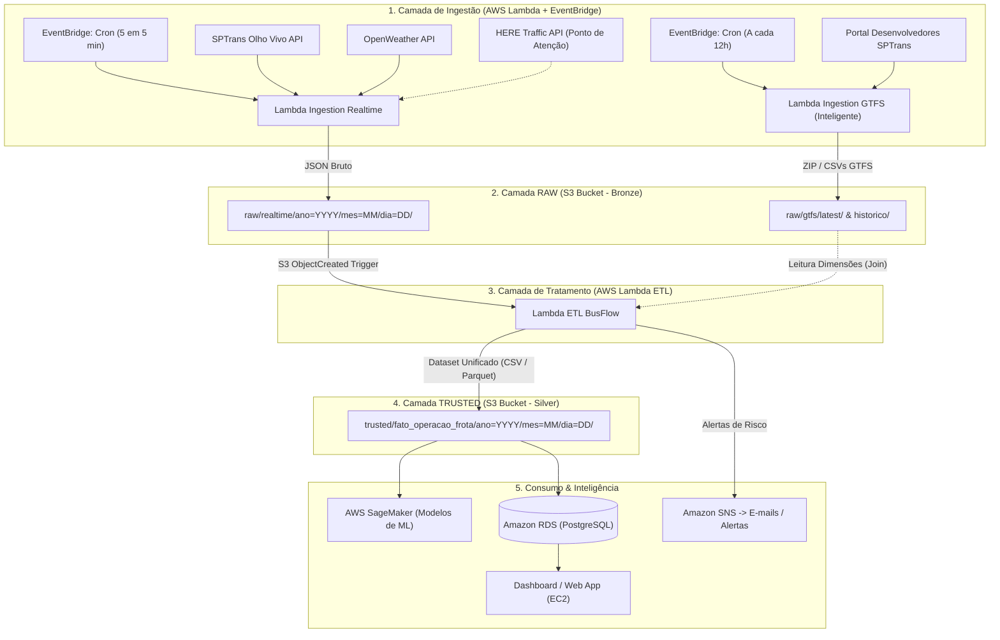

# Documentação Técnica: Pipeline de Dados e Modelagem da Camada Trusted (Arquitetura V3)
**Projeto:** BusFlow - Otimização de Transporte Público Urbano  
**Versão da Arquitetura:** V3 (AWS Serverless + Lakehouse)

---

## 1. Visão Geral da Arquitetura

O ecossistema do **BusFlow** implementa um pipeline de dados distribuído e automatizado na AWS para capturar, tratar, enriquecer e classificar dados operacionais de transporte público da cidade de São Paulo em tempo real.

---

## 2. Ingestão de Dados (Camada RAW)

A camada **RAW** preserva os dados em seu formato original, garantindo auditoria, rastreabilidade e histórico de execução.

### 2.1. Lambda 1: Ingestão em Tempo Real (`lambda-ingestion-realtime`)
* **Gatilho:** EventBridge Rule a cada 5 minutos.
* **Fontes Coletadas:**
  1. **SPTrans Olho Vivo (`/Posicao`):** Posição geográfica atual de toda a frota de ônibus (`py`, `px`, `ta`), prefixos (`p`), quantidade de veículos por linha (`qv`), linha (`c`, `cl`, `sl`, `lt0`, `lt1`).
  2. **OpenWeather (`/weather`):** Condições climáticas no município de São Paulo (temperatura, sensação térmica, chuva acumulada, visibilidade, vento, condição do tempo).
  3. **HERE Traffic (Mock / Preparado):** Dados viários de velocidade real vs fluxo livre e incidentes.
* **Destino no S3:** `s3://<raw-bucket>/realtime/ano=YYYY/mes=MM/dia=DD/raw_busflow_YYYYMMDD_HHMMSS.json`

### 2.2. Lambda 2: Ingestão GTFS Inteligente (`lambda-ingestion-gtfs`)
* **Gatilho:** EventBridge Rule a cada 12 horas (ex: 03:00 e 15:00 UTC).
* **Inteligência de Atualização:**
  - Realiza a autenticação no portal de desenvolvedores da SPTrans.
  - Verifica o cabeçalho `ETag` / `Last-Modified` ou calcula o hash SHA-256 do arquivo antes de reprocessar.
  - Se não houver alteração em relação ao arquivo atual, a execução é encerrada com sucesso sem custo de transferência.
  - Se houver atualização, faz o upload em `raw/gtfs/historico/gtfs_YYYYMMDD.zip` e atualiza o ponteiro `raw/gtfs/latest/gtfs_atual.zip`.

---

## 3. Estrutura da Tabela na Camada TRUSTED (Dataset para ML)

A camada **TRUSTED** armazena o dado tabular consolidado, enriquecido e normalizado, contendo tanto as **variáveis de entrada brutas** quanto os **sub-índices matemáticos calculados** e o **target operacional**, permitindo total interpretabilidade para modelos de Machine Learning.

### 3.1. Dicionário de Dados da Tabela `fato_operacao_frota`

| Coluna | Tipo | Origem | Descrição e Justificativa |
| :--- | :--- | :--- | :--- |
| `timestamp_processamento` | `TIMESTAMP` | Sistema | Data e hora em que o registro foi consolidado no ETL. |
| `linha_codigo` | `VARCHAR(20)` | SPTrans (`c`) | Código da linha (ex: `5023-10`, `3737-10`). |
| `linha_id` | `INT` | SPTrans (`cl`) / GTFS | Identificador numérico da linha na SPTrans. |
| `sentido` | `INT` | SPTrans (`sl`) / GTFS | Sentido da linha (1: Principal/Ida, 2: Secundário/Volta). |
| `letreiro_origem` | `VARCHAR(100)` | SPTrans (`lt0`) | Nome do terminal/ponto de partida. |
| `letreiro_destino` | `VARCHAR(100)` | SPTrans (`lt1`) | Nome do terminal/ponto final. |
| `dia_semana` | `INT` | Calculado | 0 = Segunda, ..., 6 = Domingo (para sazonalidade de calendário GTFS). |
| `hora_minuto` | `VARCHAR(5)` | Calculado | Faixa de horário da operação (ex: `08:30`). |
| **--- DADOS REAIS DA OPERAÇÃO ---** | | | |
| `frota_ativa_real` | `INT` | SPTrans (`qv`) | Número de veículos reportando posição no instante da coleta. |
| `headway_real_min` | `FLOAT` | SPTrans / Calculado | Intervalo médio real entre veículos consecutivos na linha. |
| `velocidade_media_real_kmh` | `FLOAT` | SPTrans (`Δp/Δt`) | Velocidade média estimada do deslocamento dos ônibus. |
| **--- DADOS PROGRAMADOS (GTFS) ---** | | | |
| `frota_planejada` | `INT` | GTFS (`frequencies.txt`) | Número de veículos programados para aquela faixa de horário. |
| `headway_planejado_min` | `FLOAT` | GTFS (`headway_secs / 60`) | Intervalo programado entre partidas de ônibus. |
| `tempo_viagem_esperado_min`| `FLOAT` | GTFS (`stop_times.txt`) | Duração planejada para percorrer o trajeto. |
| **--- DADOS CLIMÁTICOS (OPENWEATHER) ---** | | | |
| `temperatura_c` | `FLOAT` | OpenWeather (`main.temp`) | Temperatura atual em °C. |
| `sensacao_termica_c` | `FLOAT` | OpenWeather (`main.feels_like`)| Sensação térmica em °C (conforto térmico). |
| `chuva_1h_mm` | `FLOAT` | OpenWeather (`rain.1h`) | Volume de chuva na última hora (0.0 caso não chova). |
| `visibilidade_m` | `INT` | OpenWeather (`visibility`) | Alcance visual em metros (ex: 10000m normal, <4000m crítico). |
| `vento_velocidade_ms` | `FLOAT` | OpenWeather (`wind.speed`) | Velocidade do vento em m/s. |
| `clima_evento_id` | `INT` | OpenWeather (`weather[0].id`) | Código de severidade da condição meteorológica. |
| **--- DADOS DE TRÁFEGO VIÁRIO (HERE) ---** | | | |
| `jam_factor` | `FLOAT` | HERE Traffic / Fallback | Nível de congestionamento do corredor viário (0.0 a 10.0). |
| `velocidade_via_kmh` | `FLOAT` | HERE Traffic / Fallback | Velocidade média de tráfego na via. |
| `velocidade_freeflow_kmh`| `FLOAT` | HERE Traffic / Fallback | Velocidade da via em condições ideais sem trânsito. |
| `incidente_critico` | `INT` | HERE Incidentes / Fallback | 0 = Não, 1 = Sim (acidentes, obras, alagamentos no trajeto). |
| **--- SUB-ÍNDICES CALCULADOS ---** | | | |
| `iac_gargalo_climatico` | `FLOAT` | Calculado ($0 - 100$) | Índice de Impacto Climático ($GC$). |
| `gt_gargalo_trafego` | `FLOAT` | Calculado ($0 - 100$) | Índice de Impacto Viário ($IIV$). |
| `hp_horario_pico` | `FLOAT` | Calculado ($0.2, 0.5, 0.8$) | Peso de sensibilidade do período operacional. |
| `ac_aderencia_cronograma`| `FLOAT` | Calculado ($0.0 - 1.0$) | Proximidade entre o programado e o real executado. |
| `dfi_demanda_frota_ideal`| `FLOAT` | Calculado ($0 - 100$) | Risco de dimensionamento e déficit de ônibus. |
| **--- TARGETS & CLASSIFICAÇÃO OPERACIONAL ---** | | | |
| `deficit_operacional` | `INT` | Calculado | $\text{Frota Estimada Necessária} - \text{Frota Ativa Real}$. |
| `go_gargalo_operacional` | `FLOAT` | Calculado ($0.0 - 1.0$) | Índice Geral de Gargalo Operacional ($GO$). |
| `status_classificacao` | `VARCHAR(30)` | Calculado | `Estabilizado` (0-45%), `Risco` (46-55%), `Alto Risco` (56-65%), `Congestionamento` (66-100%). |
| `acao_recomendada` | `VARCHAR(100)` | Regra / ML Target | Ex: `Operação Normal`, `Monitorar Linha em Alerta`, `Disponibilizar 1 ônibus`, `Disponibilizar 2 ônibus`. |

---

## 4. Fórmulas Matemáticas e Regras de Negócio do ETL

### 4.1. Gargalo Climático ($IAC$ / $GC$)
$$IAC = (\text{Sev}_{\text{Chuva}} \times 0.35) + (\text{Sev}_{\text{Visib}} \times 0.20) + (\text{Sev}_{\text{Vento}} \times 0.20) + (\text{Sev}_{\text{Temp}} \times 0.15) + (\text{Sev}_{\text{Evento}} \times 0.10)$$

* **Classificação do $IAC$:**
  * `0 - 29`: Normal
  * `30 - 59`: Moderada
  * `60 - 79`: Agravante
  * `80 - 100`: Crítica

### 4.2. Gargalo de Tráfego ($GT$ / $IIV$)
$$IIV = (0.70 \times \text{FLOW}) + (0.25 \times \text{INC}) + (0.05 \times \text{TEND})$$
* $\text{FLOW} = \text{jamFactor} \times 10$ (escala 0 a 100).
* $\text{INC}$ = Severidade de bloqueios/obras (0 = sem incidentes, 50 = obras, 100 = via bloqueada).
* $\text{TEND}$ = Tendência do tráfego (50 = estável, 100 = piorando, 0 = dispersando).

### 4.3. Horário de Pico ($HP$)
* **HORÁRIO DE PICO ($0.8$):** Intervalos de pico da manhã (06:30–09:00) e pico da tarde/noite (17:00–20:00).
* **HORÁRIO EXAUSTIVO ($0.5$):** Horários de entrepico comercial (09:00–17:00).
* **HORÁRIO TRANQUILO ($0.2$):** Horários noturnos e madrugadas (20:00–06:30).

### 4.4. Aderência ao Cronograma ($AC$)
$$AC = \min\left(1.0, \frac{\text{Headway Planejado}}{\max(1.0, \text{Headway Real})}\right)$$

### 4.5. Demanda de Frota Ideal ($DFI$) e Déficit
$$\text{Frota Necessária Estimada} = \left\lceil \text{Frota Planejada} \times \left(1 + \frac{IAC + IIV}{200}\right) \right\rceil$$
$$\text{Déficit Operacional} = \max(0, \text{Frota Necessária Estimada} - \text{Frota Ativa Real})$$
$$\text{Risco Congestionamento Frota } (DFI) = \min\left(100\%, \frac{\text{Frota Necessária}}{\text{Frota Ativa Real}} \times 50\right)$$

### 4.6. Gargalo Operacional Geral ($GO$)
$$GO = (0.15 \times HP) + (0.25 \times \frac{IAC}{100}) + (0.25 \times \frac{IIV}{100}) + (0.25 \times \frac{DFI}{100}) + (0.10 \times (1 - AC))$$

* **Status Final (Matriz Calibrada de 4 Níveis):**
  * $0.00 \le GO \le 0.45$: **Estabilizado** (`Operação Normal`)
  * $0.46 \le GO \le 0.55$: **Risco** (`Monitorar Linha em Alerta`)
  * $0.56 \le GO \le 0.65$: **Alto Risco** (`Disponibilizar {Déficit} ônibus`) $\rightarrow$ *Dispara Notificação AWS SNS*
  * $0.66 \le GO \le 1.00$: **Congestionamento** (`Disponibilizar {Déficit} ônibus / Desvios`) $\rightarrow$ *Dispara Notificação AWS SNS*

---

## 5. ⚠️ Ponto de Atenção: Integração da API de Tráfego HERE

A equipe de desenvolvimento deve providenciar os seguintes itens para conectar o tráfego viário em tempo real:
1. **Credenciais:** Chave de API da plataforma HERE (`HERE_API_KEY`).
2. **Endpoints Necessários:**
   * **Traffic Flow v7:** `https://data.traffic.hereapi.com/v7/flow` (parâmetros de bounding box para a Grande São Paulo ou polilinha das rotas do GTFS `shapes.txt`).
   * **Traffic Incidents v7:** `https://data.traffic.hereapi.com/v7/incidents` (para identificar bloqueios e acidentes em tempo real).
3. **Mecanismo de Fallback (Enquanto a API HERE estiver pendente):**
   * O pipeline estima o congestionamento a partir da variação de posição dos ônibus da SPTrans e assume condições normais (`jamFactor = 3.0`, `incidente = 0`) para não interromper a execução do fluxo.
