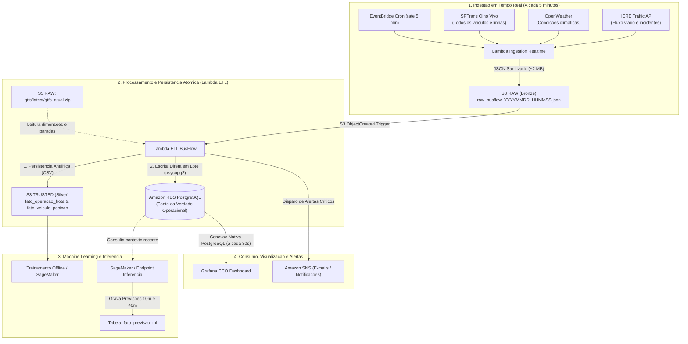

# Plano de Implementacao: Fluxo de Dados em Tempo Real e Integracao RDS / Grafana

**Projeto:** BusFlow - Inteligencia Operacional de Transporte Publico  
**Modulo:** Arquitetura Serverless, Fluxo de Dados e Integracao Operacional  
**Versao:** 2.0 (Sem intermediarios de sincronizacao, persistencia atomica direta)

---

## 1. O Conceito de Circulacao da Frota e Paradas Dinamicas (1 a N)

No setor de engenharia de transportes, a visualizacao apresentada no painel e denominada **Diagrama de Circulacao Linear (ou Diagrama Espaco-Tempo)**.

```text
Terminal Origem                                                                     Terminal Destino
[Parada 1] ---> [Parada 2] ---> [Parada 3] ---> ... ---> [Parada 12] ---> ... ---> [Parada N]
   * Carro 03      (livre)         * Carro 07             * Carro 12             * Carro 13
  (Verde)                         (Amarelo)              (Verde)                 (Verde)
                                       |
                       [Parada 4] ---> [Parada 5]
                          * Carro 09     * Carro 10
                         (Vermelho)     (Vermelho) ---> Deteccao de Comboio (Bus Bunching)
```

### 1.1 Por que 18 no exemplo do Figma e como funciona no mundo real?
* O numero **1 a 18** foi o exemplo pratico desenhado no prototipo do Figma para ilustrar o itinerario da Linha 5023.
* Na cidade de Sao Paulo, **o numero de paradas e estritamente dinamico**: cada linha cadastrada no GTFS possui $N$ paradas ordenadas (`stop_sequence`: 1 a 18, 1 a 32, 1 a 45, etc.).
* O sistema opera de forma dinamica:
  1. A tabela `dim_linha_parada` contem a lista ordenada de pontos de parada de cada linha ($1 \dots N$).
  2. Para cada onibus em circulacao reportado pela SPTrans com latitude e longitude, o Lambda ETL realiza uma busca de vizinho mais proximo (`cKDTree`) contra os pontos daquela linha e determina instantaneamente a parada sequencial correspondente.
  3. O painel plota os veiculos ao longo do eixo horizontal de 1 a $N$.

### 1.2 Valor Operacional da Visualizacao
O operador do Centro de Controle Operacional (CCO) identifica em segundos:
* **Efeito Comboio (*Bus Bunching*):** Onibus colados na mesma parada ou em paradas consecutivas (ex: Carro 09 na parada 4 e Carro 10 na parada 5).
* **Buraco Operacional (*Headway Gap*):** Trechos extensos sem nenhum carro atendendo os passageiros (ex: entre a parada 12 e a parada 16).

---

## 2. Fluxo de Dados Fim-a-Fim (Arquitetura sem Sync Intermediario)

Para evitar atrasos de processamento, filas de espera ou perda de sincronismo, a arquitetura elimina funcoes intermediarias de sincronizacao. O Lambda ETL executa uma **persistencia atomica dupla**: no S3 TRUSTED (para historico e treino) e diretamente no Amazon RDS PostgreSQL (para consumo imediato da tela).



---

## 3. Coerencia Temporal e Prevencao de Perda de Alertas no ML

### 3.1 O Problema da Frequencia de Coleta
Se o modelo de Machine Learning emite um alerta para **daqui a 10 minutos**, o ciclo de coleta **deve obrigatoriamente rodar a cada 5 minutos**:
* Se a coleta rodasse a cada 30 minutos, um gargalo previsto para daqui a 10 minutos ocorreria e se dissiparia sem que o banco sequer registrasse a confirmacao.
* Com a coleta a cada 5 minutos, ocorrem dois ciclos de medicao antes que a previsao atinja seu horizonte, permitindo auditar com exatidao a evolucao do transito.

### 3.2 O Conceito de `timestamp_alvo` Absoluto (Carimbo Imutavel)
O modelo nao armazena frases relativas. Ele grava um **carimbo de data e hora absoluto**:

1. **Instante da Inferencia ($t = 18:00$):**
   * O modelo avalia a Linha 5023 e projeta o cenario para um horizonte de 10 minutos.
   * Insere em `fato_previsao_ml`:
     * `timestamp_previsao = '2026-09-20 18:00:00+00'`
     * `timestamp_alvo = '2026-09-20 18:10:00+00'`
     * `status_previsto = 'Gargalo'`
     * `deficit_veiculos = 2`
2. **Instante da Materializacao ($t = 18:10$):**
   * O pipeline das 18:10 roda e grava o estado real observado na tabela `fato_linha_operacao` com `timestamp_registro = '2026-09-20 18:10:00+00'`.
3. **Auditoria Instantanea no Grafana:**
   * A view `v_grafana_validacao_ml` faz a juncao relacional direta entre `fato_previsao_ml.timestamp_alvo` e `fato_linha_operacao.timestamp_registro`.
   * Mesmo que a coleta atrase ligeiramente (ex: rodando as 18:12), a clausula com janela de tolerancia (`INTERVAL '3 minutes'`) localiza o lote e realiza a auditoria:
     * Status Previsto: `Gargalo` | Status Real: `Gargalo` -> Classificacao: **`ACERTO (TP)`**.

---

## 4. Como o Grafana Renderiza os Paineis do Figma (Sem Backend Adicional)

O Grafana conecta diretamente na instancia do PostgreSQL na porta 5432 utilizando o plugin nativo de PostgreSQL Data Source.

| Componente no Figma | Tipo de Painel no Grafana | Fonte de Dados / Query no RDS |
| :--- | :--- | :--- |
| **Donut de Status (Linha ou Geral)** | **Pie Chart** | `SELECT status_linha, COUNT(*) FROM v_grafana_status_linhas GROUP BY 1;` |
| **Lista Lateral de Frotas / Carros** | **Table / State Timeline** | `SELECT prefixo_carro, status_carro FROM v_grafana_circulacao_carros WHERE linha_codigo = '5023';` |
| **Cards de Alerta com Justificativa** | **News / Table Panel (Markdown)** | `SELECT linha_codigo, acao_necessaria, justificativa FROM fato_previsao_ml WHERE alerta_ativo = TRUE;` |
| **Grafico Frota x Demanda** | **Time Series (Area Preenchida)** | `SELECT timestamp_registro AS time, frota_ativa_real AS "Demanda Real", frota_necessaria_dfi AS "Demanda Ideal" FROM fato_linha_operacao WHERE linha_codigo = '5023' ORDER BY time;` |
| **Aderencia ao Cronograma** | **Bar Chart** | `SELECT linha_codigo, aderencia_cronograma_pct FROM v_grafana_status_linhas ORDER BY aderencia_cronograma_pct ASC;` |
| **Circulacao da Frota (Regua 1 a N)** | **Bar Gauge / State Timeline** | `SELECT prefixo_carro, ponto_parada_seq, status_carro FROM v_grafana_circulacao_carros WHERE linha_codigo = '5023';` |

---

## 5. Guia de Execucao para o Time Subir o Banco Novo

Para que qualquer membro da equipe sincronize o repositorio e atualize a infraestrutura na AWS:

### Passo 1: Atualizar o Repositorio Local
```bash
git pull origin main
```

### Passo 2: Aplicar o Schema SQL no RDS PostgreSQL
Conectar ao RDS a partir de uma maquina autorizada (Bastion Host, VPN ou Notebook SageMaker dentro da VPC):

```bash
# Execucao via psql
psql -h <ENDPOINT_DO_RDS> -p 5432 -U postgres -d busflowdb -f src/database/schema_busflow_rds.sql
```

Ou via script Python:
```python
import psycopg2

with open("src/database/schema_busflow_rds.sql", "r", encoding="utf-8") as f:
    ddl_sql = f.read()

conn = psycopg2.connect(
    host="<ENDPOINT_DO_RDS>",
    port=5432,
    database="busflowdb",
    user="postgres",
    password="<SENHA_RDS>"
)
with conn.cursor() as cur:
    cur.execute(ddl_sql)
conn.commit()
conn.close()
print("Schema BusFlow aplicado com sucesso no RDS PostgreSQL.")
```

### Passo 3: Atualizar a Infraestrutura via Terraform
Como os parametros de conexao do RDS foram integrados ao modulo da Lambda ETL, basta aplicar o Terraform:

```bash
cd terraform
terraform init
terraform apply -auto-approve
```

O Lambda ETL passara a gravar simultaneamente no **Amazon S3 TRUSTED** e no **Amazon RDS PostgreSQL**, mantendo o banco continuamente atualizado a cada ciclo de 5 minutos para o Grafana e para o Machine Learning.
