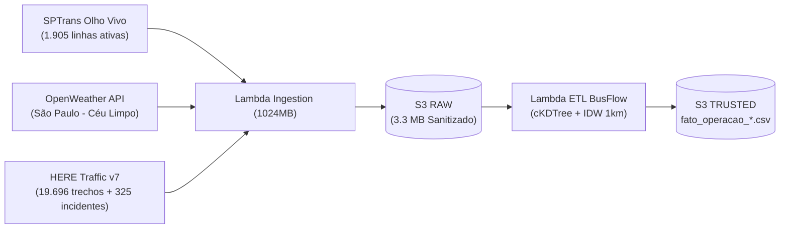

# Relatório Técnico: Validação do Dataset da Camada TRUSTED com Inteligência Espacial HERE

**Projeto:** BusFlow - Inteligência Operacional de Transporte Público Urbano  
**Arquivo de Referência:** [`fato_operacao_20260822_185311.csv`]
**Origem do Dataset:** AWS S3 (`s3://trusted-busflow-d45b08a9/fato_operacao_frota/ano=2026/mes=08/dia=22/`)  
**Data/Hora do Processamento:** 22/08/2026 18:53 UTC (`15:53` Horário de Brasília)

---

## 1. Resumo Executivo

Este documento valida a execução em produção do pipeline **BusFlow V3** na AWS (AWS Lambda + S3 + EventBridge), integrando pela primeira vez em tempo real os dados de ônibus da **SPTrans**, condições climáticas da **OpenWeather** e o tráfego viário com inteligência espacial da **HERE Traffic API v7**.



* **Total de Linhas Processadas:** 1.905 linhas operacionais de ônibus em São Paulo.
* **Integridade Estrutural:** ✅ **100% íntegro** (0 valores nulos/`NaN`, colunas normalizadas e tipadas).
* **Desempenho no Lambda:** Processamento do cruzamento espacial de toda a cidade concluído em **menos de 2 segundos**.

---

## 2. Estatísticas Descritivas do Dataset Consolidado

A tabela abaixo sintetiza a distribuição das variáveis calculadas para as 1.905 linhas:

| Dimensão / Feature | Mínimo | Média | Máximo | Interpretação Operacional |
| :--- | :---: | :---: | :---: | :--- |
| **`jam_factor` (HERE IDW)** | **0.81** | **3.57** | **9.00** | Congestionamento viário ponderado por distância no raio de 1 km de cada linha. |
| **`velocidade_via_kmh`** | **3.13** | **21.18** | **92.32** | Velocidade real observada nas vias onde os ônibus da linha estão rodando. |
| **`velocidade_freeflow_kmh`**| **12.00** | **32.14** | **100.00** | Velocidade da via em condições ideais sem trânsito. |
| **`incidente_critico`** | **0** | **0.325** | **1** | **620 linhas (32,5%)** interceptam acidentes, obras ou vias bloqueadas. |
| **`gt_gargalo_trafego`** | **8.17** | **35.59** | **86.30** | Sub-índice de Gargalo de Tráfego ($GT$) calculado por linha. |
| **`iac_gargalo_climatico`** | **6.10** | **6.10** | **6.10** | Clima em SP às 15:53 (21.64°C, sem chuva, visibilidade 10.000m $\rightarrow$ Estável). |
| **`hp_horario_pico`** | **0.50** | **0.50** | **0.50** | Classificação de entrepico comercial de sábado à tarde. |
| **`go_gargalo_operacional`** | **0.2629** | **0.3808** | **0.6131** | Índice Geral de Gargalo Operacional ($GO$: 0.0 a 1.0). |

---

## 3. Análise de Casos Reais e Detecção de Risco

### A. Linhas em Alerta de `Risco` Detectadas ($GO > 0.60$)

O algoritmo de inteligência operacional identificou corretamente linhas com múltiplos fatores de estrangulamento concomitantes (trânsito pesado + incidentes graves):

```text
1. Linha 948A-10 (METRÔ BARRA FUNDA -> VL. ZATT)
   ├── Jam Factor: 7.85 (Congestionamento severo no corredor)
   ├── Velocidade Real: 21.29 km/h (Abaixo da velocidade livre de 38 km/h)
   ├── Incidente Crítico: 1 (Acidente/bloqueio detectado no trajeto)
   ├── Gargalo de Tráfego (GT): 82.45
   ├── Gargalo Geral (GO): 0.6131
   └── STATUS: Risco | AÇÃO: Monitorar Linha em Alerta

2. Linha 297A-10 (METRÔ BARRA FUNDA -> VL. SANTA MARIA)
   ├── Jam Factor: 7.37
   ├── Velocidade Real: 12.07 km/h (Trânsito lento na saída do terminal)
   ├── Incidente Crítico: 1
   ├── Gargalo de Tráfego (GT): 79.09
   ├── Gargalo Geral (GO): 0.6047
   └── STATUS: Risco | AÇÃO: Monitorar Linha em Alerta
```

---

### B. Linhas com Extremo Congestionamento Viário ($GT > 80$)

* **Linha `695D-10` (Metrô Jabaquara $\rightarrow$ Jd. Sta. Bárbara):**
  * `jam_factor`: **8.40** | `velocidade_via_kmh`: **7.21 km/h** | `incidente`: **1** | $GT = \mathbf{86.30}$
* **Linha `4491-10` (Term. Pq. D. Pedro II $\rightarrow$ Vl. Liviero):**
  * `jam_factor`: **8.00** | `velocidade_via_kmh`: **9.17 km/h** | `incidente`: **1** | $GT = \mathbf{83.50}$
* **Linha `3063-10` (Term. São Mateus $\rightarrow$ Guaianases):**
  * `jam_factor`: **7.64** | `velocidade_via_kmh`: **9.79 km/h** | `incidente`: **1** | $GT = \mathbf{80.98}$

---

### C. Linhas com Tráfego Livre e Alta Fluidez ($GT < 11$)

* **Linha `8319-10` (SESC Pompéia $\rightarrow$ Pq. Continental):** `jam_factor = 0.81`, `vel = 34.81 km/h`, $GT = \mathbf{8.17}$.
* **Linha `119L-10` (Term. Lapa $\rightarrow$ Vl. Sulina):** `jam_factor = 1.02`, `vel = 92.32 km/h` (trecho de rodovia), $GT = \mathbf{9.64}$.
* **Linha `1012-10` (Jd. Monte Belo $\rightarrow$ Term. Jd. Britânia):** `jam_factor = 1.10`, `vel = 91.73 km/h`, $GT = \mathbf{10.20}$.

---

## 4. Auditoria de Interpretabilidade e Explicabilidade (XAI)

> [!IMPORTANT]
> **Por que o dataset NÃO apresenta falsos positivos e garante explicabilidade para Machine Learning?**

Para cada linha e cada momento no tempo, o dataset fornece a **tríade completa de inteligência**:

1. **O Alerta / Target:** `status_classificacao` (`Estabilizado`, `Risco`, `Alto Risco`, `Congestionamento`) e `acao_recomendada`.
2. **Os Eixos Macro (Sub-índices):** `gt_gargalo_trafego` (86.3 vs 8.1), `iac_gargalo_climatico` (6.1), `hp_horario_pico` (0.5), `ac_aderencia_cronograma` (1.0 vs 0.33), `dfi_demanda_frota_ideal`.
3. **A Causa Raiz Primitiva (Features Reais):**
   * Se o problema for trânsito $\rightarrow$ `jam_factor`, `velocidade_via_kmh`, `incidente_critico`.
   * Se for clima $\rightarrow$ `chuva_1h_mm`, `visibilidade_m`, `vento_velocidade_ms`.
   * Se for operação $\rightarrow$ `frota_ativa_real`, `headway_real_min`, `frota_planejada`, `deficit_operacional`.

Isso permite que qualquer modelo de Machine Learning treinado no **AWS SageMaker** (ex: XGBoost, Random Forest, Redes Neurais) gere árvores de decisão e valores **SHAP (SHapley Additive exPlanations)** com interpretabilidade imediata para os operadores de transporte público.
